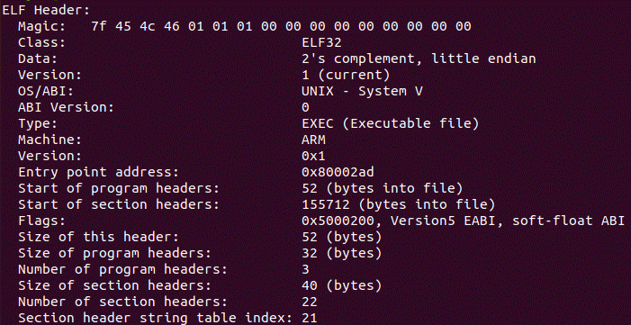
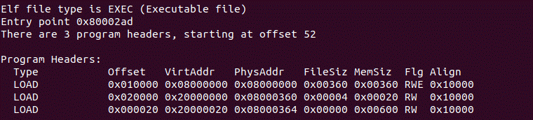

#\#天子守国门，君王死社稷#
		明成祖时期，因北方时常受到鞑靼和瓦剌的威胁，且还有北元蒙古势力的南袭，再加上北平是朱棣的兴王之地，所以明成祖朱棣在1421年迁都北平，并改北平为京师。因地理位置上，明王朝首都京师靠近边关重镇山海关，且又是天子所居住的地方，所以民间对此称为“天子守国门”。
		崇祯皇帝时期，公元1644年，李自成攻下明王朝首都，崇祯皇帝表示任贼分裂朕尸，勿伤百姓一人，至死不退，吊死煤山，民间对此事件称为“君王死社稷”。
___
##ELF - 可执行和链接格式 (ELF) 文件
[原文链接](https://man7.org/linux/man-pages/man5/elf.5.html)

	elf.h

		一个使用ELF文件格式的可执行文件包括一个ELF头，后面跟着一个 program 头表或一个 section 头表，或两者都有。ELF头始终位于文件的偏移量0处。
		program 头表和 section 头表在文件中的偏移量在ELF头中定义。这两个表描述了文件的其余细节。
		在 elf.h 中以C语言结构定义了上述的 ELF头，还包括动态部分、重定位部分和符号表的结构。
___
###ELF header (Ehdr)
<html>
	<table style="margin-left: auto; margin-right: auto;">
			<td>
				
			</td>
			<td>
				<pre>
ELF头定义：
typedef struct {
	unsigned char e_ident[EI_NIDENT];
		// EI_NIDENT 	e_ident数组的大小。
		uint16_t      e_type;
		uint16_t      e_machine;
		uint32_t      e_version;
		ElfN_Addr     e_entry;
		ElfN_Off      e_phoff;
		ElfN_Off      e_shoff;
		uint32_t      e_flags;
		uint16_t      e_ehsize;
		uint16_t      e_phentsize;
		uint16_t      e_phnum;
		uint16_t      e_shentsize;
		uint16_t      e_shnum;
		uint16_t      e_shstrndx;
   } ElfN_Ehdr;
            	</pre>
			</td>
    </table>
</html>

		 e_ident 这个字节数组指定如何解释文件，独立于处理器或文件的剩余内容。在这个数组中，所有内容都由以前缀EI_开头d的宏命名，并可能包含以前缀ELF开头的值。例如:
<pre>
	#define EI_MAG0			0		/* File identification byte 0 index */
	#define EI_MAG1			1		/* File identification byte 1 index */
	#define EI_MAG2			2		/* File identification byte 2 index */
	#define EI_MAG3			3		/* File identification byte 3 index */
	#define EI_CLASS		4		/* File class byte index */
	#define EI_DATA			5		/* Data encoding byte index */
	#define EI_VERSION		6		/* File version byte index */
	#define EI_OSABI		7		/* OS ABI identification */
	#define EI_ABIVERSION	8		/* ABI version */
	#define EI_PAD			9		/* Byte index of padding bytes */
	其余保留
</pre>

		e_type 该成员标识了对象文件的类型。
		e_machine 该成员指定单个文件所需的架构。
		e_version 标识文件版本
		e_entry 该成员给出系统首先向其传输控制的虚拟地址，从而启动进程。如果文件没有关联的入口点，则该成员保存为0。
		e_phoff 该成员保存程序头表的文件偏移量(以字节为单位)。如果文件没有程序头表，则该成员保存为0。
		e_shoff 该成员保存着section头表的文件偏移量(以字节为单位)。如果文件没有section头表，该成员保存为0。
		e_flags 该成员保存与文件相关的特定处理器标志。标志名称采用EF_ ' machine_flag'的形式。目前，还没有定义标志。
		e_ehsize 该成员保存ELF头的大小(以字节为单位)。
		e_phentsize 该成员保存着文件程序头表中一个表项的字节大小;所有条目的大小相同。
		e_phnum 该成员保存程序头表中的条目数。因此，e_phentsize和e_phnum的乘积以字节为单位给出了表的大小。如果文件没有程序头，e_phnum保存值为0。
				如果程序头表中的表项数量大于或等于PN_XNUM (0xffff)，则该成员持有PN_XNUM (0xffff)，而程序头表中实际的表项数量保存在section头表中初始表项的sh_info成员中。否则，初始条目的sh_info成员的值为0。
		e_shentsize 该成员保存section头的大小(以字节为单位)。section头是section头表中的一个条目;所有条目的大小相同。
		e_shnum 该成员保存section头表中的条目数。
		e_shstrndx 该成员保存着与section name string表相关联的section头表索引。如果文件中没有section name string表，该成员保存SHN_UNDEF值。
					如果section name string table section的索引大于或等于SHN_LORESERVE (0xff00)，这个成员保存着SHN_XINDEX (0xffff)， section name string table section的真实索引保存在section头表中初始表项的sh_link成员中。否则，section头表中初始表项的sh_link成员的值为0。
___
###Program header (Phdr)

<table style="margin-left: auto; margin-right: auto;">
	<td> <big> 
			程序头(Phdr)一个可执行或共享object文件的程序头表是一个结构数组，每个结构描述一个段或系统准备执行程序所需的其他信息。
			一个object文件段包含一个或多个节。程序头只对可执行和共享的object文件有意义。一个文件通过ELF头的e_phentsize和e_phnum成员来指定它自己的程序头大小。ELF程序头由Elf32_Phdr或Elf64_Phdr类型描述，具体取决于体系结构:
</big>
		
		<big>ELF32 的程序头与 ELF64的 程序头略有不同。</big>
	</td>
	<td>
		<pre>
	程序头定义：
	typedef struct {
		   uint32_t   p_type;
		   Elf32_Off  p_offset;
		   Elf32_Addr p_vaddr;
		   Elf32_Addr p_paddr;
		   uint32_t   p_filesz;
		   uint32_t   p_memsz;
		   uint32_t   p_flags;
		   uint32_t   p_align;
	   } Elf32_Phdr;
		</pre>
	</td>
</table>

	p_type 这个成员指明了数组元素描述的段的类型，以及如何解释数组元素的信息。
	p_offset 成员保存着该段的第一个字节所在的文件开头的偏移量。
	p_vaddr 该成员保存段的第一个字节驻留在内存中的虚拟地址。
	p_paddr 在与物理寻址相关的系统上，这个成员被保留给段的物理地址。在BSD下，该成员不使用，并且必须为零。
	p_filesz 该成员保存段的文件映像中的字节数。它可能是零。
	p_memsz 该成员保存段的内存映像中的字节数。它可能是零。
	p_flags 这个成员持有一个与段相关的位掩码.
	p_align 该成员保存着在内存和文件中对这些段进行对齐的值。
___
###Section header (Shdr)

<table style="margin-left: auto; margin-right: auto;">
<big> <pre>
	Section头(Shdr)文件的Section头表可以定位文件的所有Section。section头表是一个Elf32_Shdr或Elf64_Shdr结构的数组。ELF头的e_shoff成员给出了从文件开始到section头表的字节偏移量。E_shnum保存section头表中包含的条目数。E_shentsize保存每个表项的字节大小。
	section头表索引是这个数组的下标。部分section头表的索引是保留的:初始表项以及SHN_LORESERVE和SHN_HIRESERVE之间的索引。初始项用于ELF扩展名e_phnum, e_shnum和e_shstrndx;在其他情况下，初始条目中的每个字段都被设为零。
	32位和64位区段头之间不存在真正的区别。
</pre></big>
	<td>
		
	</td>
	<td>
		<pre>
	扇区头定义：
	typedef struct {
		   uint32_t   sh_name;
		   uint32_t   sh_type;
		   uint32_t   sh_flags;
		   Elf32_Addr sh_addr;
		   Elf32_Off  sh_offset;
		   uint32_t   sh_size;
		   uint32_t   sh_link;
		   uint32_t   sh_info;
		   uint32_t   sh_addralign;
		   uint32_t   sh_entsize;
	   } Elf32_Shdr;
		</pre>
	</td>
</table>

	sh_name 该成员指定节的名称。它的值是section头字符串表section的索引，给出了一个以空结尾的字符串的位置。
	sh_type 该成员对节的内容和语义进行分类。
	sh_flags 如果在sh_flags中设置了一个标志位，则该section的属性为"on"。否则，该属性为“off”或不适用。未定义的属性设置为0。
	sh_addr 如果该section出现在进程的内存映像中，则该成员保存该section的第一个字节所在的地址。否则，成员包含0。
	sh_offset 该成员的值保存着从文件开头到section中第一个字节的偏移量。
	sh_size 该成员保存section的字节大小。
	sh_link 该成员持有一个section头表索引链接，其解释取决于section类型。
	sh_info 该成员保存着在内存和文件中对这些段进行对齐的值。
	sh_addralign 有些部分具有地址对齐约束。
	sh_entsize 有些section保存着一个包含固定大小的条目的表，比如一个符号表。
<pre>.text
	该段保存程序的“文本”或可执行指令。
.rodata
	该section保存只读数据，这些数据通常会在进程映像中构成不可写的段。
.init_array
	这个部分保存了进程初始化代码的可执行指令。当程序开始运行时，系统会在调用主程序入口点之前安排执行本节中的代码。
.fini_array
	这个部分保存了进程终止代码的可执行指令。当程序正常退出时，系统会安排执行本节中的代码。
.data
	该section保存着为程序的内存映像贡献的初始化数据。
.bss
	该section保存着未初始化的数据，这些数据构成了程序的内存映像。根据定义，当程序开始运行时，系统用零初始化数据。
.symtab
	这个section保存着一个符号表。
.strtab
	该section保存字符串，最常见的是表示与符号表项关联的名称的字符串。
.shstrtab
	这个section保存着section名。</pre>
___
####String and symbol tables
	字符串表部分保存以空结尾的字符序列，通常称为字符串。目标文件使用这些字符串来表示符号和节名。一种是将字符串作为索引引用到字符串表部分。第一个字节，即索引0，被定义为保存一个空字节('\0')。类似地，字符串表的最后一个字节被定义为保存一个空字节，确保所有字符串的空终止。
	一个object文件的符号表保存了定位和重定位程序的符号定义和引用所需的信息。符号表索引是这个数组的下标。
	...
####Relocation entries (Rel & Rela)
	重定位是将符号引用与符号定义连接起来的过程。可重定位文件必须具有描述如何修改其section内容的信息，从而允许可执行和共享object文件保存进程程序映像的正确信息。重定位表项就是这些数据。
####Dynamic tags (Dyn)

