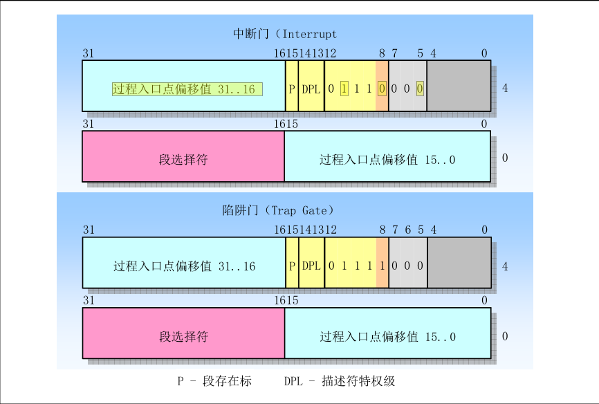

[TOC]

## Global
	从硬盘加载第一个扇区至内存0x7c00处， 然后从0x7c00开始执行代码。


##	TIP
	Addres = ((Segment-Reg_Value) << 4) + OFFSET

## bootsects.s
	指定根文件系统所在的设备号 ROOT_DEV
	将本身的512Byte 复制到 0x90000开始的地方
	从硬盘加载 setup.s (4个扇区 4*512) 到0x90200开始的地方
	打印 "loading system ..." 信息
	从硬盘加载 system (240个扇区 240*512) 到0x10000开始的地方
	跳转到 setup.s

### ?
	为什么system 要在 bootsect.s里面读取到0x10000，然后再移动到0x0开始的地方 ?
		中断向量表在0x0开始的地方，后续需要用到BIOS中断读取硬件数据，还不能覆盖。
		so, 我可以在硬件数据读取完之后，再进行 system 的读取吗？ 即使会覆盖中断向量表？ 中断开始后，被覆盖会有影响吗?虽然从内存转移比较安全。

## setup.s
	读取硬件的各项参数，保存到 bootsects.s 存储的地方，被覆盖是没有关系的。
	转移 system 到 0x0 开始的地方。
	将 IDT地址(0x0) 传入 IDT寄存器, GDT地址(0x90200 + offset) 传入 GDT寄存器。
	打开A20总线。
	8259重编程。
	进入保护模式。
	跳转 -> GDT的第一个段描述符。 (即 跳转到 system代码中。)

### ？
	GDT 目前还没开启分页，却使用分页的方法来计算出长度? 0x07FF -> 8Mb  (2048*4096=8Mb)

## head.s
	head.s 是system中的开始部分。
	将 GDT中的第二个段描述符加载到各个段寄存器。
	??? 设置堆栈。
	填充IDT表， 重新设置LDT寄存器。
	设置新的GDT寄存器。(改变原来的第一个和第二个描述符段长度为16Mb)。
	重新加载各个段寄存器。
	重新设置堆栈。
	检测A20总线是否开启。
	设置协处理器。
	将main函数地址压入栈中。
	填充页目录表。从(0x0开始覆盖head.s)。
	从后往前填充页表信息，地址和读写权限等。
	将页目录表地址写入CR3寄存器。
	启动分页，写入CR0寄存器。
	return 跳转到main函数。

### mm

## init
### main.c

## kernel
### traps.c
	trap_init 设置中断向量表。(IDT表)。

## include
### asm
#### system.h
```c
set_trap_gate(0,&divide_error);
```
```c
#define set_intr_gate(n,addr) \
	_set_gate(&idt[n],14,0,addr)
```
	set_gate(gate_addr, type, dpl, addr)
	先看寄存器参数,此时
	eax = 0x0008-0000
	edx = 0x0000-addr

```asm
	movw %%dx,%%ax		// eax = 0x0008(段选择符)-addr(入口偏移15..0)
	movw %0,%%dx		// edx = 0x0000(入口偏移31..16)-(0x8000+(dpl<<13)+(type<<8))(信号位)
	movl %%eax,%1		// gate_addr[].a = eax
	movl %%edx,%2		// gate_addr[].b = edx
```
	idt 表中描述符的格式为


