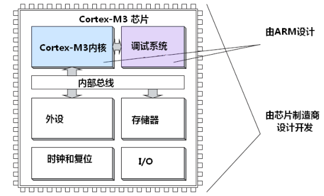

###MCU组成与CPU的关系

	MCU = CPU + Other(时钟和复位、I/O、存储器、外设)					//通过内部总线连接

###m3寄存器组
	通用寄存器
	R0-R7 低组寄存器
	R8-R12 高组寄存器 (16bit的thumb指令少数可以访问)
	R13 堆栈指针，MSP和PSP,同一时刻只能使用一个，MSP需要特权使用					//堆栈指针最低两位永远为0
	R14 连接寄存器	LR
	R15 程序计数器 PC

	特殊寄存器
	程序状态字寄存器组（PSRs）
	中断屏蔽寄存器组（PRIMASK, FAULTMASK, BASEPRI）特权模式方可访问
	控制寄存器（CONTROL）
	主堆栈指针（MSP），或写作 SP_main。这是缺省的堆栈指针，它由 OS 内核、异常服务
	例程以及所有需要特权访问的应用程序代码来使用。

	进程堆栈指针（PSP），或写作 SP_process。用于常规的应用程序代码（不处于异常服
	用例程中时）

	CM3的PC通常为奇数，用意表明是在Thumb模式下，若PC等于0，则视为企图转入ARM模式

###M3特点
	寄存器、系统数据总线、存储器结构都是32bit
	D-Bus和I-Bus共享同一存储空间
	支持大、小端
	哈佛结构
	Cortex‐M3 处理器支持两种处理器的操作模式，还支持两级特权操作

###总线接口
	Cortex‐M3 内部有若干个总线接口，以使 CM3 能同时取址和访内（访问内存），它们是：
		指令存储区总线（两条）
		系统总线
		私有外设总线
	有两条代码存储区总线负责对代码存储区的访问，分别是 I‐Code 总线和 D‐Code 总线。前者用
	于取指，后者用于查表等操作，它们按最佳执行速度进行优化。
	系统总线用于访问内存和外设，覆盖的区域包括 SRAM，片上外设，片外 RAM，片外扩展设备，
	以及系统级存储区的部分空间。
	私有外设总线负责一部分私有外设的访问，主要就是访问调试组件。它们也在系统级存储区

###MPU
	MPU 在保护内存时是按区管理的

###Bit banding
	bit_word_addr = bit_band_base + (byte_offset x 32) + (bit_number × 4)

		bit_word_addr is the address of the word in the alias memory region that maps to the
		targeted bit.
		bit_band_base is the starting address of the alias region
		byte_offset is the number of the byte in the bit-band region that contains the targeted
		bit
		bit_number is the bit position (0-7) of the targeted bit.

###启动模式选择
	Main Flash memory
	System memory
	Embedded SRAM
	
#####题外话
	关于thumb：
	thumb指令集中的 thumb，英文本意是拇指，拇指在所有手指中是短小而粗壮的，拇指能力是强于其他指头的，并且简短。
	应该是取意 “短小精干” 吧
	请注意：CM3 并不支持所有的 Thumb‐2 指令

	关于堆栈：
	SP堆栈保存的是地址，32bit，所以是四字节对齐
	关于堆栈的操作，因为存放数据时，是从低往高存，所以压栈时需要先把指针移动到合适的位置
