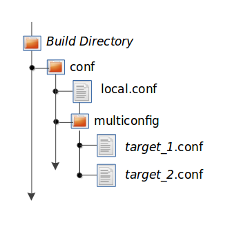

[TOC]
###1 概述

	欢迎使用 BitBake 用户手册。本手册提供了 BitBake 工具的相关信息。这些信息会尽量避免与使用了 BitBake 的构建系统相关，例如 OpenEmbedded 和 Yocto 项目。但在某些情况下，手册中使用了系统内容中的场景或示例来帮助理解。对于这些情况，手册中清楚地说明了其上下文。

####1.1 简介

	从根本上说，BitBake 是一个通用的任务执行引擎，允许 shell 和 Python 任务在复杂的任务间依赖约束下高效、并行运行。 BitBake 的主要用户之一，OpenEmbedded，采用这个核心并使用面向任务的方法构建嵌入式 Linux 软件堆栈。

	从概念上讲，BitBake 在某些方面类似于 GNU Make，但有显着差异：
        I BitBake 根据提供的构建任务的元数据执行任务。元数据存储在配方 (.bb) 和相关配方“附加” (.bbappend) 文件、配置 (.conf) 和底层包含 (.inc) 文件以及类 (.bbclass) 文件中。元数据为 BitBake 提供了有关要运行哪些任务以及这些任务之间的依赖关系的说明。
        II BitBake 包含一个获取器库，用于从本地文件、源代码控制系统或网站等不同位置获取源代码。
        III 每个要构建的单元（例如一个软件）的指令被称为“配方”文件，并包含有关该单元的所有信息（依赖关系、源文件位置、校验和、描述等）。
        IV BitBake 包含一个客户端/服务器抽象，可以从命令行使用，也可以通过 XML-RPC 用作服务，并具有多种不同的用户界面。

####1.2 历史和目标

	BitBake 最初是 OpenEmbedded 项目的一部分。它的灵感来自于 Gentoo Linux 发行版使用的 Portage 包管理系统。 2004 年 12 月 7 日，OpenEmbedded 项目组成员 Chris Larson 将项目分成两个不同的部分：
        I BitBake，一个通用的任务执行器。
        II OpenEmbedded，BitBake 使用的元数据集。

    今天，BitBake 是 OpenEmbedded 项目的主要基础，该项目被用于构建和维护 Linux 发行版，例如在 Yocto 项目的保护下开发的 Poky Reference Distribution。

    在 BitBake 之前，没有其他构建工具能够充分满足所有的嵌入式 Linux 发行版的需求。传统桌面 Linux 发行版使用的所有构建系统都缺乏重要的功能，并且在嵌入式领域流行的基于 Buildroot 的临时系统都没有可扩展性或可维护性。

    BitBake 的一些重要的初衷是：
        I 处理交叉编译。
        II 处理包间依赖关系（在目标架构构建时、本机架构构建时，还有运行时）。
        III 支持在给定包中运行任意数量的任务，包括但不限于获取上游源数据、解包、打补丁、配置等。
        IV 无需指定构建和目标系统的 Linux 发行版。
        V 与架构无关。
        VI 支持多种构建和目标操作系统（例如 Cygwin、BSD 等）。是独立的，而不是紧密集成到构建机器的根文件系统中。
        VII 处理目标架构、操作系统、发行版和机器上的条件元数据。
        VIII 为本地元数据和操作包提供易于使用的工具。
        IX 易于使用 BitBake 在多个项目之间进行协作以进行构建。
        X 提供一种继承机制以在许多包之间共享通用元数据。

    随着时间的推移，很明显需要一些进一步的要求：
        I 处理基本配方的变体（例如 native、sdk 和 multilib）。
        II 将元数据分层并允许层进行扩展或覆盖其他层。
        III 允许将给定的一组输入变量表示为校验和。基于该校验和，允许使用预构建组件加速构建。

    BitBake满足所有原始要求，并通过对基本功能进行扩展以实现其他要求。灵活性和力量一直是首要任务。BitBake 具有高度可扩展性，并支持嵌入式 Python 代码和任意任务的执行。

####1.3 概念

    BitBake 是一个用 Python 语言编写的程序。在最高级别，BitBake 解释元数据，决定需要运行哪些任务，并执行这些任务。BitBake 控制软件的构建方式与 GNU Make 类似。 GNU Make 通过“makefile”实现控制，而 BitBake 使用“recipes”。
    BitBake 通过允许定义更复杂的任务（例如组装整个嵌入式 Linux 发行版）扩展了 GNU Make 等简单工具的功能。
    本节的其余部分介绍了几个应该理解的概念，以便更好地利用 BitBake 的强大功能。

#####1.3.1 配方
    BitBake Recipes 由文件扩展名 .bb 表示，是最基本的元数据文件。这些配方文件为 BitBake 提供以下内容：
            I 关于包的描述信息（作者、主页、许可证等）。
            II 配方的版本。
            III 现有依赖项（构建和运行时依赖项）。
            IV 源代码所在的位置以及如何获取它。
            V 源代码是否需要任何补丁，在哪里可以找到它们，以及如何应用它们。
            VI 如何配置和编译源代码。
            VII 如何将生成的工件组装成一个或多个可安装包。
            VIII 在目标机器上安装创建的包或包的位置。

    在 BitBake 的上下文中，或任何使用 BitBake 作为其构建系统的项目中，具有 .bb 扩展名的文件被称为配方。

			Note:
			“包”一词也常用于描述配方。但是，由于使用相同的词来描述项目的打包输出，因此最好保留一个描述性术语 - “配方”。换句话说，单个“配方”文件完全能够生成许多相关但可单独安装的“包”。事实上，这种能力相当普遍。

#####1.3.2 配置文件
        由 .conf 扩展名表示的配置文件定义了管理项目构建过程的各种配置变量。这些文件分为定义机器配置、发行版配置、可能的编译器调整、一般通用配置和用户配置的几个区域。主要配置文件是示例 bitbake.conf 文件，它位于 BitBake 源代码树 conf 目录中。

#####1.3.3 类
        由 .bbclass 扩展名表示的类文件包含有助于在元数据文件之间共享信息。 BitBake 源代码树目前带有一个名为 base.bbclass 的类元数据文件。您可以在 classes 目录中找到此文件。 base.bbclass 类文件很特殊，因为它总是自动包含在所有配方和类中。此类包含标准基本任务的定义，例如获取、解包、配置（默认为空）、编译（运行任何存在的 Makefile）、安装（默认为空）和打包（默认为空）。这些任务通常被项目开发过程中添加的其他类覆盖或扩展。

#####1.3.4 层
    层允许您将不同类型的自定义相互隔离。虽然您可能会发现在处理单个项目时将所有内容都放在一个层中很诱人，但元数据越模块化，就越容易应对未来的变化。
    为了说明如何使用层来保持模块化，请考虑您可能进行的自定义以支持特定的目标机器。这些类型的定制通常位于一个特殊层，而不是一个通用层，称为板支持包 (BSP) 层。此外，例如，机器定制应该与支持新 GUI 环境的配方和元数据隔离开来。这种情况为您提供了几层：一层用于机器配置，一层用于 GUI 环境。然而，重要的是要理解，BSP 层仍然可以对 GUI 环境层中的配方进行特定于机器的添加，而不会因这些特定于机器的更改而污染 GUI 层本身。您可以通过作为 BitBake 附加 (.bbappend) 文件的配方来完成此操作。

#####1.3.5 附加文件
	附加文件（具有 .bbappend 文件扩展名的文件）扩展或覆盖现有配方文件中的信息。
	BitBake 期望每个附加文件都有一个相应的配方文件。此外，附加文件和相应的配方文件必须使用相同的根文件名。文件名只能在使用的文件类型后缀上有所不同（例如 formfactor_0.0.bb 和 formfactor_0.0.bbappend）。
	附加文件中的信息扩展或覆盖了底层、类似名称的配方文件中的信息。
	命名附加文件时，可以使用“%”通配符来匹配配方名称。例如，假设您有一个名为如下的附加文件：
			busybox_1.21.%.bbappend
	该附加文件将匹配任何busybox_1.21.x.bb 版本的配方。因此，附加文件将匹配以下配方名称：
			busybox_1.21.1.bb
			busybox_1.21.2.bb
			busybox_1.21.3.bb

			Note:
			“%”字符的使用受到限制，因为它只能直接在附加文件名称的.bbappend 部分前面使用。您不能在名称的任何其他位置使用通配符。

	如果busybox 配方更新为busybox_1.3.0.bb，附加名称将不匹配。但是，如果您将附加文件命名为busybox_1.%.bbappend，那么您将得到一个匹配项。
	在最一般的情况下，您可以将附加文件命名为简单的busybox_%.bbappend 以完全独立于版本。

####1.4 获取 BitBake

    您可以通过几种不同的方式获取 BitBake：
        I 克隆 BitBake：使用 Git 克隆 BitBake 源代码存储库是获取 BitBake 的推荐方法。克隆存储库可以轻松修复错误并访问稳定分支和主分支。克隆 BitBake 后，应使用最新的稳定分支进行开发，因为主分支用于 BitBake 开发，可能包含不太稳定的更改。
        您通常需要与您正在使用的元数据匹配的 BitBake 版本。元数据通常向后兼容，但不向前兼容。
        这是一个克隆 BitBake 存储库的示例：
            $ git clone git://git.openembedded.org/bitbake
        此命令将 BitBake Git 存储库克隆到名为 bitbake 的目录中。或者，如果您想将新目录称为 bitbake 以外的名称，您可以在 git clone 命令之后指定一个目录。这是一个将目录命名为 bbdev 的示例：
            $ git clone git://git.openembedded.org/bitbake bbdev

        II 使用您的分发包管理系统安装：不建议使用此方法，因为您的分发包管理系统提供的 BitBake 版本在大多数情况下落后 BitBake 存储库快照几个版本。

        III 拍摄 BitBake 的快照：从源代码存储库下载 BitBake 的快照可让您访问 BitBake 的已知分支或版本。

			Note:
        	如前所述，克隆 Git 存储库是获取 BitBake 的首选方法。随着补丁添加到稳定的分支，克隆存储库可以更容易地更新。

        以下示例下载 BitBake 版本 1.17.0 的快照：
            $ wget https://git.openembedded.org/bitbake/snapshot/bitbake-1.17.0.tar.gz
            $ tar zxpvf bitbake-1.17.0.tar.gz
        使用 tar 实用程序解压缩 tarball 后，您将拥有一个名为 bitbake-1.17.0 的目录。

        IV 使用随您的构建检查附带的 BitBake：获取 BitBake 副本的最后一种可能性是，它已经随您检查更大的基于 BitBake 的构建系统，例如 Poky。您可以检查整个构建系统，而不是手动检查各个层并将它们粘合在一起。打包时已经包含一个经过全面测试与其他组件的兼容性的 BitBake 版本。有关如何检查特定基于 BitBake 的构建系统的信息，请查阅该构建系统的支持文档。

####1.5 BitBake 命令

    bitbake 命令是 BitBake 工具的主要接口。本节介绍 BitBake 命令语法并提供几个运行示例。

#####1.5.1 用法和语法
    以下是 BitBake 的用法和语法：
    $ bitbake -h
    用法：bitbake [options] [recipename/target recipe:do_task ...]

    为给定的一组目标配方（.bb 文件）执行指定的任务（默认为“构建”）。
    假设在 cwd 或 BBPATH 中有一个 conf/bblayers.conf 可用，它将提供层、BBFILES 和其他配置信息。

        选项：
        --version 显示程序的版本号并退出
        -h, --help 显示此帮助信息并退出
        -b BUILDFILE, --buildfile=BUILDFILE
            直接从特定的 .bb 配方执行任务。
            警告：不会处理来自其他配方的任何依赖项。
        -k, --continue 出错后尽可能继续。
                虽然失败的目标和任何依赖它的东西都不能被建造，尽可能在建造之前停止。
        -f, --force 强制指定的目标/任务运行（使任何现有的文件戳无效）。
        -c CMD, --cmd=CMD 指定要执行的任务。 可用的确切选项取决于元数据。
                一些示例可能是 'compile' 或 'populate_sysroot' 或 'listtasks' 可能会给出可用任务的列表。
        -C INVALIDATE_STAMP，--clear-stamp=INVALIDATE_STAMP
                指定例如'compile'任务的标记无效， 然后运行目标的默认任务。
        -r PREFILE, --read=PREFILE
                在 bitbake.conf 之前读取指定文件。
        -R POSTFILE，--postread=POSTFILE
                在 bitbake.conf 之后读取指定的文件。
        -v, --verbose 启用 shell 任务跟踪（使用“set -x”）。
                同时将 bb.note(...) 消息打印到标准输出（此外，将它们写入 ${T}/log.do_<task>)。
        -D, --debug 提高调试级别。
                您可以多次指定它。
                -D 将调试级别设置为 1，其中仅将 bb.debug(1, ...) 消息打印到标准输出；
                -DD 将调试级别设置为 2，其中同时打印 bb.debug(1, ...) 和 bb.debug(2, ...) 消息，以此类推。
                如果没有 -D，则不会打印任何调试消息。
                请注意，-D 仅影响到标准输出的输出。无论调试级别如何，所有调试消息都写入 ${T}/log.do_taskname。
        -q, --quiet 向终端输出较少的日志消息数据。你可以多次指定。
        -n, --dry-run 不执行，只做动作。
        -S SIGNATURE_HANDLER, --dump-signatures=SIGNATURE_HANDLER
                转出签名构造信息，不执行任何任务。
                SIGNATURE_HANDLER 参数传递给处理程序。
                两个常用值是 none 和 printdiff，但处理程序可以定义更多/更少。
                none 意味着只转储签名，printdiff 意味着将转储的签名与缓存的签名进行比较。
        -p, --parse-only 解析 BB 配方后退出。
        -s, --show-versions 显示所有配方的当前和首选版本。
        -e, --environment 显示全局或每个配方环境以及有关变量设置/更改位置的信息。
        -g, --graphviz 以dot语法保存指定目标的依赖关系树信息。
        -I EXTRA_ASSUME_PROVIDED，--ignore-deps=EXTRA_ASSUME_PROVIDED
                假设这些依赖项不存在并且已经提供（相当于 ASSUME_PROVIDED）。 有助于使依赖图更具吸引力。
        -l DEBUG_DOMAINS, --log-domains=DEBUG_DOMAINS
                显示指定日志记录域的调试日志记录
        -P, --profile 配置命令并保存报告。
        -u UI, --ui=UI 要使用的用户界面（knotty、ncurses、taskexp 或 teamcity - 默认为 knotty）。
        --token=XMLRPCTOKEN 指定连接到远程服务器时要使用的连接令牌。
        --revisions-changed 根据上游浮动修订是否已更改设置退出代码。
        --server-only 在没有 UI 的情况下运行 bitbake，仅启动服务器（cooker）进程。
        -B BIND, --bind=BIND 要绑定到的 bitbake xmlrpc 服务器的名称/地址
        -T SERVER_TIMEOUT, --idle-timeout=SERVER_TIMEOUT
                由于不活动而设置超时以卸载bitbake服务器，设置为-1表示不卸载，默认值：环境变量BB_SERVER_TIMEOUT。
        --no-setscene 不要运行任何场景任务。 sstate 将被忽略并构建所需的一切。
        --skip-setscene 如果它们将被执行，则跳过 setscene 任务。
                与 --no-setscene 不同，之前从 sstate 恢复的任务将被保留
        --setscene-only 只运行 setscene 任务，不运行任何实际任务。
        --remote-server=REMOTE_SERVER 连接到指定的服务器。
        -m, --kill-server 终止任何正在运行的 bitbake 服务器。
        --observe-only 作为仅观察客户端连接到服务器。
        --status-only 检查远程 bitbake 服务器的状态。
        -w WRITEEVENTLOG，--write-log=WRITEEVENTLOG
                将构建的事件日志写入 bitbake 事件 json 文件。 使用 ''（空字符串）自动分配名称。
        --runall=RUNALL 为指定目标的任务图中的任何配方运行指定的任务（即使它不会运行）。
        --runonly=RUNONLY 仅运行指定目标的任务图中的指定任务（以及这些任务可能具有的任何任务依赖项）。

#####1.5.2 示例

    本节提供一些示例，展示如何使用 BitBake。

######1.5.2.1 针对单个配方执行任务
        为单个配方文件执行任务相对简单。您指定有问题的文件，BitBake 会解析它并执行指定的任务。如果您不指定任务，BitBake 会执行默认任务，即“ build ”。 BitBake 这样做时遵循任务间依赖关系。
        以下命令在 foo_1.0.bb 配方文件上运行构建任务，这是默认任务：
            $ bitbake -b foo_1.0.bb
        以下命令对 foo.bb 配方文件运行 clean 任务：
            $ bitbake -b foo.bb -c clean

			Note:
        	“-b”选项不会处理配方依赖关系。除了出于调试目的之外，建议您使用下一节中介绍的语法。

######1.5.2.2 针对一组配方文件执行任务
        当想要管理多个 .bb 文件时，会引入许多额外的复杂性。显然，需要有一种方法来告诉 BitBake 哪些文件可用，以及哪些文件是您想要执行的。每个配方还需要有一种方法来表达其依赖关系，包括构建时和运行时。当多个配方提供相同的功能时，或者当一个配方有多个版本时，您必须有一种方法来表达配方偏好。
        bitbake 命令在不使用“–buildfile”或“-b”时只接受“PROVIDES”。你不能提供其他任何东西。默认情况下，配方文件通常“PROVIDES”其“packagename”，如下例所示：
            $ bitbake foo
        下一个示例“PROVIDES”包名称并使用“-c”选项告诉 BitBake 只执行 do_clean 任务：
            $ bitbake -c clean foo

######1.5.2.3 执行任务列表和配方组合
	当您指定多个目标时，BitBake 命令行支持为各个目标指定不同的任务。例如，假设您有两个目标（或配方）myfirstrecipe 和 mysecondrecipe，并且您需要 BitBake 为第一个配方运行 taskA，为第二个配方运行 taskB：
		$ bitbake myfirstrecipe:do_taskA mysecondrecipe:do_taskB

######1.5.2.4 生成依赖图
	BitBake 能够使用点语法生成依赖关系图。您可以使用 Graphviz 的点工具将这些图形转换为图像。
    生成依赖图时，BitBake 会将两个文件写入当前工作目录：
    	• task-depends.dot：显示任务之间的依赖关系。这些依赖项与 BitBake 的内部任务执行列表相匹配。
		• pn-buildlist：显示要构建的目标的简单列表。
	要停止依赖公共依赖，请使用 -I depend 选项，BitBake 从图中省略它们。忽略这些信息可以产生更易读的图表。这样，您可以从继承的类（例如 base.bbclass）中从图中删除 DEPENDS。
    以下是创建依赖图的两个示例。第二个示例省略了图中 OpenEmbedded 中常见的依赖：
    	$ bitbake -g foo
		$ bitbake -g -I virtual/kernel -I eglibc foo

######1.5.2.5 执行多配置构建
	BitBake 能够使用单个命令构建多个图像或包，其中不同的目标需要不同的配置（多个配置构建）。在这种情况下，每个目标都称为“multiconfig”。
	要完成多配置构建，您必须使用build目录中的并行配置文件分别定义每个目标的配置。这些 multiconfig 配置文件的位置是特定的。它们必须驻留在名为 multiconfig 的 conf 子目录中的当前构建目录中。以下是两个单独目标的示例：

	之所以需要这种文件层次结构，是因为在解析层之前不会构造 BBPATH 变量。因此，除非它位于当前工作目录中，否则无法将配置文件用作预配置文件。
	最低限度，每个配置文件必须定义机器和 BitBake 用于构建的临时目录。建议的做法是不要重叠构建期间使用的临时目录。
	除了每个目标的单独配置文件之外，您还必须启用 BitBake 以执行多个配置构建。通过在 local.conf 配置文件中设置 BBMULTICONFIG 变量来实现启用。例如，假设您在构建目录中定义了 target1 和 target2 的配置文件。 local.conf 文件中的以下语句使 BitBake 能够执行多个配置构建并指定两个额外的多重配置：
		BBMULTICONFIG = "target1 target2"
    一旦目标配置文件到位并启用 BitBake 以执行多个配置构建，请使用以下命令表单启动构建：
		$ bitbake [mc:multiconfigname:]target [[[mc:multiconfigname:]target] ... ]
    这是两个额外多重配置的示例：target1 和 target2：
    	$ bitbake mc::target mc:target1:target mc:target2:target

######1.5.2.6 启用多个配置构建依赖
	有时，多配置构建中的目标（多配置）之间可能存在依赖关系。例如，假设为了构建特定架构的image，需要存在用于不同架构的另一个构建的根文件系统。换句话说，第一个 multiconfig 的映像取决于第二个 multiconfig 的根文件系统。这种依赖关系本质上是配方中构建一个 multiconfig 的任务依赖于构建另一个 multiconfig 的配方中任务的完成。
	要在多配置构建中启用依赖项，您必须使用以下语句形式在配方中声明依赖项：
    	task_or_package[mcdepends] = "mc:from_multiconfig:to_multiconfig:recipe_name:task_on_which_to_depend"
    为了更好地展示如何使用此语句，请考虑一个包含两个多重配置的示例：target1 和 target2：
    	image_task[mcdepends] = "mc:target1:target2:image2:rootfs_task"
    在此示例中，from_multiconfig 为“target1”，to_multiconfig 为“target2”。其配方包含 image_task 的镜像所执行的任务取决于用于构建 image2 的 rootfs_task 的完成，该镜像与“target2”multiconfig 相关联。
    设置此依赖项后，您可以使用 BitBake 命令构建“target1”multiconfig，如下所示：
    	$ bitbake mc:target1:image1
    此命令执行为“target1”multiconfig 创建 image1 所需的所有任务。由于依赖关系，BitBake 还通过 rootfs_task 执行“target2”多配置构建。
	拥有一个依赖于另一个构建的根文件系统的配方可能看起来没有那么有用。考虑对 image1 配方中的语句的这种更改：
    	image_task[mcdepends] = "mc:target1:target2:image2:image_task"
	在这种情况下，BitBake 必须为“target2”构建创建 image2，因为“target1”构建依赖于它。
	因为“target1”和“target2”为多个配置构建启用并且具有单独的配置文件，BitBake 将每个构建的工件放置在各自的临时构建目录中。

####总结
	第一章简单介绍了bitbake recipe的组成文件，bitbake的由来，以及bitbake的一些常见用法。

