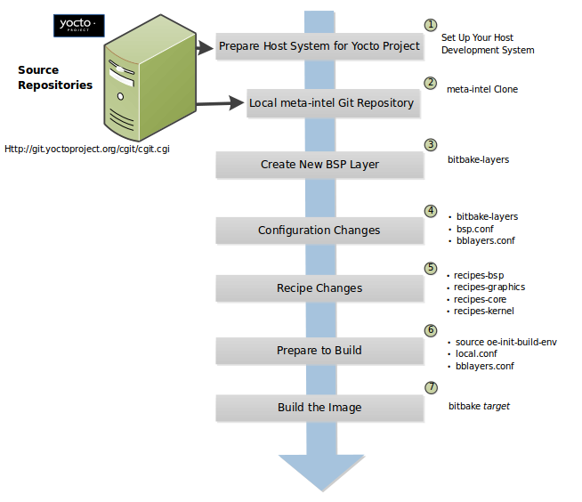

[TOC]
## Yocto Project Board Support Package Developer’s Guide
[原文地址](https://docs.yoctoproject.org/bsp-guide/index.html)

### 1 板级支持包 (BSP) - 开发人员指南
	板级支持包 (BSP) 是定义如何支持特定硬件设备、设备集或硬件平台的信息集合。 BSP 包括有关设备上存在的硬件功能的信息和内核配置信息以及所需的任何其他硬件驱动程序。除了通用 Linux 软件堆栈之外，BSP 还列出了必要的和可选平台功能所需的任何其他软件组件。
	本指南提供有关 BSP 层的信息，定义组件结构以使 BSP 遵循通常理解的布局，讨论如何为 BSP 定制配方，解决 BSP 许可问题，并提供信息，向您展示如何使用bitbake-layers 工具。

#### 1.1 BSP 层
	BSP 由基本目录中的文件结构组成。总而言之，您可以将基本目录、其文件结构和内容视为 BSP 层。虽然不是严格要求，但 Yocto 项目中的 BSP 层使用以下公认的命名约定：
			meta-bsp_root_name
	字符串“meta-”附加在机器或平台名称之前，即上述形式的“bsp_root_name”。

			笔记
			因为 BSP 层命名约定已经确立，所以在创建层时建议遵循它。从技术上讲，BSP 层名称不需要以 meta- 开头。但是，Yocto Project 开发环境中的各种脚本和工具都采用这种约定。

	为了帮助理解 BSP 层概念，请考虑 Yocto 项目支持并随每个版本提供的 BSP。您可以通过 https://git.yoctoproject.org/cgit/cgit.cgi/ 的 Web 界面查看 Yocto 项目源存储库中的层。如果您转到该界面，您将在“Yocto 元数据层”下找到一个存储库列表。

			笔记
			作为 Yocto 项目的一部分不再积极支持的层显示在标题“Yocto 元数据层存档”下。

	每个存储库都是 Yocto 项目支持的 BSP 层（例如 meta-raspberrypi 和 meta-intel）。这些层中的每一个都是其自身的存储库，单击层名称会显示两个 URL，您可以从中将层的存储库克隆到本地系统。这是一个克隆 Raspberry Pi BSP 层的示例：
			$ git clone git://git.yoctoproject.org/meta-raspberrypi

	除了 BSP 层之外，meta-yocto-bsp 层是随附的 poky 存储库的一部分。 meta-yocto-bsp 层维护了几个“参考”BSP，包括基于 ARM 的 Beaglebone、基于 MIPS 的 EdgeRouter，以及 32 位和 64 位 IA 机器的通用版本。
	有关典型 BSP 开发工作流程的信息，请参阅开发板级支持包 (BSP) 部分。有关如何从 Git 存储库设置源文件的本地副本的更多信息，请参阅 Yocto 项目开发任务手册中的定位 Yocto 项目源文件部分。
	BSP 层的基目录 (meta-bsp_root_name) 是该层的根目录。该目录是您添加到构建目录中的 conf/bblayers.conf 文件中的 BBLAYERS 变量的内容，该目录是在您运行 OpenEmbedded 构建环境设置脚本（即 oe-init-build-env）后建立的。添加根目录允许 OpenEmbedded 构建系统识别 BSP 层并从中构建映像。这是一个例子：
			BBLAYERS ?= " \
			   /usr/local/src/yocto/meta \
			   /usr/local/src/yocto/meta-poky \
			   /usr/local/src/yocto/meta-yocto-bsp \
			   /usr/local/src/yocto/meta-mylayer \
			   "

			笔记
			BBLAYERS 中列出的层的顺序和 BBFILE_PRIORITY 很重要。例如，如果多个层定义了一个机器配置，OpenEmbedded 构建系统使用给定相似层优先级的最后一层搜索。构建系统自上而下通过 BBLAYERS 中列出的层工作。
	一些 BSP 需要或依赖于 BSP 根层之外的附加层才能发挥作用。在这种情况下，您需要在 BSP 根层的自述文件“依赖项”部分中指定这些层。此外，如果 BSP 存在任何构建指令，您必须将它们添加到“依赖项”部分。
	一些层用作保存其他 BSP 层的层。这些层被称为“容器层”。这种类型的层的一个例子是 OpenEmbedded 的 meta-openembedded 层。 meta-openembedded 层包含许多 meta-* 层。在这种情况下，您需要包含要使用的实际图层的名称，例如：
			BBLAYERS ?= " \
			  /usr/local/src/yocto/meta \
			  /usr/local/src/yocto/meta-poky \
			  /usr/local/src/yocto/meta-yocto-bsp \
			  /usr/local/src/yocto/meta-mylayer \
			  .../meta-openembedded/meta-oe \
			  .../meta-openembedded/meta-perl \
			  .../meta-openembedded/meta-networking \
			  "
	等等。
	有关层的更多信息，请参阅 Yocto 项目开发任务手册的“理解和创建层”部分。

#### 1.2 准备构建主机以使用 BSP 层
	本节介绍如何让您的构建主机准备好使用 BSP 层。设置好主机后，您可以按照“使用 bitbake-layers 脚本创建新的 BSP 层”部分中的说明创建层。

			笔记
			有关 BSP 的结构信息，请参阅示例文件系统布局部分。

	1. 设置构建环境：确保您已设置为在 shell 中使用 BitBake。有关如何准备好构建主机的信息，请参阅 Yocto 项目开发任务手册中的“准备构建主机”部分，该主机既可以是本机 Linux 机器，也可以是使用 CROPS 的机器。
	2. 克隆 poky 存储库：您需要拥有 Yocto 项目源目录的本地副本（即本地 poky 存储库）。有关如何克隆 poky 存储库并查看适合您工作的分支。
	3. 确定您想要的 BSP 层：Yocto 项目支持许多 BSP，这些 BSP 在它们自己的层中或在设计用于包含多个 BSP 的层中进行维护。要通过 BSP 层了解机器支持，您可以查看该版本的机器索引。
	4. 可选择克隆 meta-intel BSP 层：如果您的硬件基于当前的英特尔 CPU 和设备，则可以利用此 BSP 层。有关 meta-intel BSP 层的详细信息，请参阅该层的 README 文件。
		I. 导航到您的源目录：通常，您在源目录中设置 meta-intel Git 存储库（例如 poky）。
				$ cd /home/you/poky
		II. 克隆图层:
				$ git clone git://git.yoctoproject.org/meta-intel.git
				Cloning into 'meta-intel'...
				remote: Counting objects: 15585, done.
				remote: Compressing objects: 100% (5056/5056), done.
				remote: Total 15585 (delta 9123), reused 15329 (delta 8867)
				Receiving objects: 100% (15585/15585), 4.51 MiB | 3.19 MiB/s, done.
				Resolving deltas: 100% (9123/9123), done.
				Checking connectivity... done.
		IIImeta-intel. 切换到正确的分支：您为 meta-intel 切换的分支必须与您用于 Yocto 项目版本的同一分支匹配（例如 kirkstone）：
				$ cd meta-intel
				$ git checkout -b kirkstone remotes/origin/kirkstone
				Branch kirkstone set up to track remote branch
				kirkstone from origin.
				Switched to a new branch 'kirkstone'

			笔记
			要查看克隆存储库中可用的分支名称，请使用 git branch -al 命令。有关更多信息，请参阅 Yocto 项目开发任务手册中的“在 Poky 中按分支切换”部分。

	5. 可选设置备用 BSP 层：如果您的硬件可以更紧密地用于不在meta-intel BSP 层内的现有 BSP，您可以克隆该 BSP 层。
		该过程与用于meta-intel层的过程相同，但层的名称除外。例如，如果您确定您的硬件与元树莓派最匹配，请克隆该层：
			$ git clone git://git.yoctoproject.org/meta-raspberrypi
			Cloning into 'meta-raspberrypi'...
			remote: Counting objects: 4743, done.
			remote: Compressing objects: 100% (2185/2185), done.
			remote: Total 4743 (delta 2447), reused 4496 (delta 2258)
			Receiving objects: 100% (4743/4743), 1.18 MiB | 0 bytes/s, done.
			Resolving deltas: 100% (2447/2447), done.
			Checking connectivity... done.

	6. 初始化构建环境：在源目录（即 poky）的根目录中，运行 oe-init-build-env 环境设置脚本以在构建主机上定义 OpenEmbedded 构建环境。
			$ source oe-init-build-env
	除其他外，该脚本创建构建目录，在这种情况下构建并位于源目录中。脚本运行后，您的当前工​​作目录将设置为构建目录。

#### 1.3 示例文件系统布局
	定义一个通用的 BSP 目录结构可以让最终用户理解并熟悉该标准。通用格式还鼓励对硬件的软件支持进行标准化。
	本节中描述的建议表单确实具有特定于 OpenEmbedded 构建系统的元素。除了 OpenEmbedded 构建系统之外，开发人员还可以将此结构与其他构建系统一起使用。如果需要，还可以很容易地提取信息并将其转换为其他格式。 OpenEmbedded 构建系统通过其标准的层机制，可以直接接受描述为层的格式。 BSP 层使用标准格式在一个位置捕获所有特定于硬件的细节，这对于希望使用硬件平台的任何人都非常有用，无论他们使用的是什么构建系统。
	BSP 规范不包括构建系统或其他工具 - 该规范仅涉及特定于硬件的组件。在最终分发点，您可以将 BSP 层与构建系统和其他工具相结合。意识到保持 BSP 层、构建系统和工具是可以在某些最终产品中组合的独立组件这一区别很重要。
	在查看 BSP 层内的目录结构的推荐形式之前，您应该知道有一些要求才能使 BSP 层被认为与 Yocto 项目兼容。有关该要求列表，请参阅“已发布的 BSP 要求”部分。
	下面是 BSP 层的典型目录结构。虽然这种基本形式代表了标准，但要意识到各个 BSP 的实际布局可能会有所不同。
			meta-bsp_root_name/
			meta-bsp_root_name/bsp_license_file
			meta-bsp_root_name/README
			meta-bsp_root_name/README.sources
			meta-bsp_root_name/binary/bootable_images
			meta-bsp_root_name/conf/layer.conf
			meta-bsp_root_name/conf/machine/*.conf
			meta-bsp_root_name/recipes-bsp/*
			meta-bsp_root_name/recipes-core/*
			meta-bsp_root_name/recipes-graphics/*
			meta-bsp_root_name/recipes-kernel/linux/linux-yocto_kernel_rev.bbappend

	以下是可从 Source Repositories 获得的 Raspberry Pi BSP 层的示例：
			meta-raspberrypi/COPYING.MIT
			meta-raspberrypi/README.md
			meta-raspberrypi/classes
			meta-raspberrypi/classes/sdcard_image-rpi.bbclass
			meta-raspberrypi/conf/
			meta-raspberrypi/conf/layer.conf
			meta-raspberrypi/conf/machine/
			meta-raspberrypi/conf/machine/raspberrypi-cm.conf
			meta-raspberrypi/conf/machine/raspberrypi-cm3.conf
			meta-raspberrypi/conf/machine/raspberrypi.conf
			meta-raspberrypi/conf/machine/raspberrypi0-wifi.conf
			meta-raspberrypi/conf/machine/raspberrypi0.conf
			meta-raspberrypi/conf/machine/raspberrypi2.conf
			meta-raspberrypi/conf/machine/raspberrypi3-64.conf
			meta-raspberrypi/conf/machine/raspberrypi3.conf
			meta-raspberrypi/conf/machine/include
			meta-raspberrypi/conf/machine/include/rpi-base.inc
			meta-raspberrypi/conf/machine/include/rpi-default-providers.inc
			meta-raspberrypi/conf/machine/include/rpi-default-settings.inc
			meta-raspberrypi/conf/machine/include/rpi-default-versions.inc
			meta-raspberrypi/conf/machine/include/tune-arm1176jzf-s.inc
			meta-raspberrypi/docs
			meta-raspberrypi/docs/Makefile
			meta-raspberrypi/docs/conf.py
			meta-raspberrypi/docs/contributing.md
			meta-raspberrypi/docs/extra-apps.md
			meta-raspberrypi/docs/extra-build-config.md
			meta-raspberrypi/docs/index.rst
			meta-raspberrypi/docs/layer-contents.md
			meta-raspberrypi/docs/readme.md
			meta-raspberrypi/files
			meta-raspberrypi/files/custom-licenses
			meta-raspberrypi/files/custom-licenses/Broadcom
			meta-raspberrypi/recipes-bsp
			meta-raspberrypi/recipes-bsp/bootfiles
			meta-raspberrypi/recipes-bsp/bootfiles/bcm2835-bootfiles.bb
			meta-raspberrypi/recipes-bsp/bootfiles/rpi-config_git.bb
			meta-raspberrypi/recipes-bsp/common
			meta-raspberrypi/recipes-bsp/common/firmware.inc
			meta-raspberrypi/recipes-bsp/formfactor
			meta-raspberrypi/recipes-bsp/formfactor/formfactor
			meta-raspberrypi/recipes-bsp/formfactor/formfactor/raspberrypi
			meta-raspberrypi/recipes-bsp/formfactor/formfactor/raspberrypi/machconfig
			meta-raspberrypi/recipes-bsp/formfactor/formfactor_0.0.bbappend
			meta-raspberrypi/recipes-bsp/rpi-u-boot-src
			meta-raspberrypi/recipes-bsp/rpi-u-boot-src/files
			meta-raspberrypi/recipes-bsp/rpi-u-boot-src/files/boot.cmd.in
			meta-raspberrypi/recipes-bsp/rpi-u-boot-src/rpi-u-boot-scr.bb
			meta-raspberrypi/recipes-bsp/u-boot
			meta-raspberrypi/recipes-bsp/u-boot/u-boot
			meta-raspberrypi/recipes-bsp/u-boot/u-boot/*.patch
			meta-raspberrypi/recipes-bsp/u-boot/u-boot_%.bbappend
			meta-raspberrypi/recipes-connectivity
			meta-raspberrypi/recipes-connectivity/bluez5
			meta-raspberrypi/recipes-connectivity/bluez5/bluez5
			meta-raspberrypi/recipes-connectivity/bluez5/bluez5/*.patch
			meta-raspberrypi/recipes-connectivity/bluez5/bluez5/BCM43430A1.hcd
			meta-raspberrypi/recipes-connectivity/bluez5/bluez5brcm43438.service
			meta-raspberrypi/recipes-connectivity/bluez5/bluez5_%.bbappend
			meta-raspberrypi/recipes-core
			meta-raspberrypi/recipes-core/images
			meta-raspberrypi/recipes-core/images/rpi-basic-image.bb
			meta-raspberrypi/recipes-core/images/rpi-hwup-image.bb
			meta-raspberrypi/recipes-core/images/rpi-test-image.bb
			meta-raspberrypi/recipes-core/packagegroups
			meta-raspberrypi/recipes-core/packagegroups/packagegroup-rpi-test.bb
			meta-raspberrypi/recipes-core/psplash
			meta-raspberrypi/recipes-core/psplash/files
			meta-raspberrypi/recipes-core/psplash/files/psplash-raspberrypi-img.h
			meta-raspberrypi/recipes-core/psplash/psplash_git.bbappend
			meta-raspberrypi/recipes-core/udev
			meta-raspberrypi/recipes-core/udev/udev-rules-rpi
			meta-raspberrypi/recipes-core/udev/udev-rules-rpi/99-com.rules
			meta-raspberrypi/recipes-core/udev/udev-rules-rpi.bb
			meta-raspberrypi/recipes-devtools
			meta-raspberrypi/recipes-devtools/bcm2835
			meta-raspberrypi/recipes-devtools/bcm2835/bcm2835_1.52.bb
			meta-raspberrypi/recipes-devtools/pi-blaster
			meta-raspberrypi/recipes-devtools/pi-blaster/files
			meta-raspberrypi/recipes-devtools/pi-blaster/files/*.patch
			meta-raspberrypi/recipes-devtools/pi-blaster/pi-blaster_git.bb
			meta-raspberrypi/recipes-devtools/python
			meta-raspberrypi/recipes-devtools/python/python-rtimu
			meta-raspberrypi/recipes-devtools/python/python-rtimu/*.patch
			meta-raspberrypi/recipes-devtools/python/python-rtimu_git.bb
			meta-raspberrypi/recipes-devtools/python/python-sense-hat_2.2.0.bb
			meta-raspberrypi/recipes-devtools/python/rpi-gpio
			meta-raspberrypi/recipes-devtools/python/rpi-gpio/*.patch
			meta-raspberrypi/recipes-devtools/python/rpi-gpio_0.6.3.bb
			meta-raspberrypi/recipes-devtools/python/rpio
			meta-raspberrypi/recipes-devtools/python/rpio/*.patch
			meta-raspberrypi/recipes-devtools/python/rpio_0.10.0.bb
			meta-raspberrypi/recipes-devtools/wiringPi
			meta-raspberrypi/recipes-devtools/wiringPi/files
			meta-raspberrypi/recipes-devtools/wiringPi/files/*.patch
			meta-raspberrypi/recipes-devtools/wiringPi/wiringpi_git.bb
			meta-raspberrypi/recipes-graphics
			meta-raspberrypi/recipes-graphics/eglinfo
			meta-raspberrypi/recipes-graphics/eglinfo/eglinfo-fb_%.bbappend
			meta-raspberrypi/recipes-graphics/eglinfo/eglinfo-x11_%.bbappend
			meta-raspberrypi/recipes-graphics/mesa
			meta-raspberrypi/recipes-graphics/mesa/mesa-gl_%.bbappend
			meta-raspberrypi/recipes-graphics/mesa/mesa_%.bbappend
			meta-raspberrypi/recipes-graphics/userland
			meta-raspberrypi/recipes-graphics/userland/userland
			meta-raspberrypi/recipes-graphics/userland/userland/*.patch
			meta-raspberrypi/recipes-graphics/userland/userland_git.bb
			meta-raspberrypi/recipes-graphics/vc-graphics
			meta-raspberrypi/recipes-graphics/vc-graphics/files
			meta-raspberrypi/recipes-graphics/vc-graphics/files/egl.pc
			meta-raspberrypi/recipes-graphics/vc-graphics/files/vchiq.sh
			meta-raspberrypi/recipes-graphics/vc-graphics/vc-graphics-hardfp.bb
			meta-raspberrypi/recipes-graphics/vc-graphics/vc-graphics.bb
			meta-raspberrypi/recipes-graphics/vc-graphics/vc-graphics.inc
			meta-raspberrypi/recipes-graphics/wayland
			meta-raspberrypi/recipes-graphics/wayland/weston_%.bbappend
			meta-raspberrypi/recipes-graphics/xorg-xserver
			meta-raspberrypi/recipes-graphics/xorg-xserver/xserver-xf86-config
			meta-raspberrypi/recipes-graphics/xorg-xserver/xserver-xf86-config/rpi
			meta-raspberrypi/recipes-graphics/xorg-xserver/xserver-xf86-config/rpi/xorg.conf
			meta-raspberrypi/recipes-graphics/xorg-xserver/xserver-xf86-config/rpi/xorg.conf.d
			meta-raspberrypi/recipes-graphics/xorg-xserver/xserver-xf86-config/rpi/xorg.conf.d/10-evdev.conf
			meta-raspberrypi/recipes-graphics/xorg-xserver/xserver-xf86-config/rpi/xorg.conf.d/98-pitft.conf
			meta-raspberrypi/recipes-graphics/xorg-xserver/xserver-xf86-config/rpi/xorg.conf.d/99-calibration.conf
			meta-raspberrypi/recipes-graphics/xorg-xserver/xserver-xf86-config_0.1.bbappend
			meta-raspberrypi/recipes-graphics/xorg-xserver/xserver-xorg_%.bbappend
			meta-raspberrypi/recipes-kernel
			meta-raspberrypi/recipes-kernel/linux-firmware
			meta-raspberrypi/recipes-kernel/linux-firmware/files
			meta-raspberrypi/recipes-kernel/linux-firmware/files/brcmfmac43430-sdio.bin
			meta-raspberrypi/recipes-kernel/linux-firmware/files/brcfmac43430-sdio.txt
			meta-raspberrypi/recipes-kernel/linux-firmware/linux-firmware_%.bbappend
			meta-raspberrypi/recipes-kernel/linux
			meta-raspberrypi/recipes-kernel/linux/linux-raspberrypi-dev.bb
			meta-raspberrypi/recipes-kernel/linux/linux-raspberrypi.inc
			meta-raspberrypi/recipes-kernel/linux/linux-raspberrypi_4.14.bb
			meta-raspberrypi/recipes-kernel/linux/linux-raspberrypi_4.9.bb
			meta-raspberrypi/recipes-multimedia
			meta-raspberrypi/recipes-multimedia/gstreamer
			meta-raspberrypi/recipes-multimedia/gstreamer/gstreamer1.0-omx
			meta-raspberrypi/recipes-multimedia/gstreamer/gstreamer1.0-omx/*.patch
			meta-raspberrypi/recipes-multimedia/gstreamer/gstreamer1.0-omx_%.bbappend
			meta-raspberrypi/recipes-multimedia/gstreamer/gstreamer1.0-plugins-bad_%.bbappend
			meta-raspberrypi/recipes-multimedia/gstreamer/gstreamer1.0-omx-1.12
			meta-raspberrypi/recipes-multimedia/gstreamer/gstreamer1.0-omx-1.12/*.patch
			meta-raspberrypi/recipes-multimedia/omxplayer
			meta-raspberrypi/recipes-multimedia/omxplayer/omxplayer
			meta-raspberrypi/recipes-multimedia/omxplayer/omxplayer/*.patch
			meta-raspberrypi/recipes-multimedia/omxplayer/omxplayer_git.bb
			meta-raspberrypi/recipes-multimedia/x264
			meta-raspberrypi/recipes-multimedia/x264/x264_git.bbappend
			meta-raspberrypi/wic meta-raspberrypi/wic/sdimage-raspberrypi.wks
	以下部分描述了提议的 BSP 格式的每个部分。

##### 1.3.1 许可证文件
	您可以在 BSP 层中找到这些文件：
			meta-bsp_root_name/bsp_license_file
	这些可选文件满足 BSP 的许可要求。此处的文件类型可能因许可要求而异。例如，在 Raspberry Pi BSP 中，所有许可要求都由 COPYING.MIT 文件处理。
	许可文件可以是 MIT、BSD、GPLv* 等。这些文件推荐用于 BSP，但它们是可选的，完全取决于 BSP 开发人员。有关如何维护许可证合规性的信息，请参阅 Yocto 项目开发任务手册中的“在产品生命周期内维护开源许可证合规性”部分。

##### 1.3.2 自述文件
		您可以在 BSP 层中找到此文件：
				meta-bsp_root_name/README
		此文件提供有关如何引导可选包含在 binary/ 目录中的实时映像的信息。自述文件还提供了构建映像所需的信息。
		README 文件至少必须包含依赖关系列表，例如 BSP 所依赖的任何其他层的名称以及 BSP 维护者的名称及其联系信息。

##### 1.3.3 README.sources 文件
	您可以在 BSP 层中找到此文件：
			meta-bsp_root_name/README.sources
	此文件提供有关在何处查找用于构建位于 meta-bsp_root_name/binary 中的映像（如果有）的 BSP 源文件的信息。二进制文件中的图像将是与 BSP 一起发布的图像。 README.sources 文件中的信息还可以帮助您找到用于生成随 BSP 提供的图像的元数据。

			笔记
			如果 BSP 的二进制目录丢失或该目录没有图像，则现有的 README.sources 文件没有意义，通常不存在。

##### 1.3.4 预构建的用户二进制文件
	您可以在 BSP 层中找到这些文件：
			meta-bsp_root_name/binary/bootable_images
	此可选区域包含有用的预构建内核和随 BSP 发布的适用于目标系统的用户空间文件系统映像。当 BSP 压缩包已创建并在 Yocto 项目网站上可用时，此目录通常包含图形（例如 Sato）和最小的实时图像。您可以使用这些内核和映像来运行系统并快速开始开发任务。
	存在的二进制文件的确切类型高度依赖于硬件。 README 文件应该存在于 BSP 层中，它解释了如何将图像与目标硬件一起使用。此外，应该存在 README.sources 文件以定位用于构建图像的源并提供有关元数据的信息。

##### 1.3.5 层配置文件
	您可以在 BSP 层中找到此文件：
			meta-bsp_root_name/conf/layer.conf
	conf/layer.conf 文件将文件结构标识为层，标识层的内容，并包含有关构建系统应如何使用它的信息。通常，标准样板文件如下所示。在以下示例中，您将用 BSP 的实际名称替换“bsp”（即示例模板中的“bsp_root_name”）。
			# We have a conf and classes directory, add to BBPATH
			BBPATH .= ":${LAYERDIR}"

			# We have a recipes directory containing .bb and .bbappend files, add to BBFILES
			BBFILES += "${LAYERDIR}/recipes-*/*/*.bb \
						${LAYERDIR}/recipes-*/*/*.bbappend"

			BBFILE_COLLECTIONS += "bsp"
			BBFILE_PATTERN_bsp = "^${LAYERDIR}/"
			BBFILE_PRIORITY_bsp = "6"
			LAYERDEPENDS_bsp = "intel"

	为了说明字符串替换，以下是 Raspberry Pi conf/layer.conf 文件中的相应语句：
			# We have a conf and classes directory, append to BBPATH
			BBPATH .= ":${LAYERDIR}"

			# We have a recipes directory containing .bb and .bbappend files, add to BBFILES
			BBFILES += "${LAYERDIR}/recipes*/*/*.bb \
						${LAYERDIR}/recipes*/*/*.bbappend"

			BBFILE_COLLECTIONS += "raspberrypi"
			BBFILE_PATTERN_raspberrypi := "^${LAYERDIR}/"
			BBFILE_PRIORITY_raspberrypi = "9"

			# Additional license directories.
			LICENSE_PATH += "${LAYERDIR}/files/custom-licenses"
			.
			.
			.
	这个文件只是让 BitBake 知道配方和配置目录。该文件必须存在，以便 OpenEmbedded 构建系统可以识别 BSP。

##### 1.3.6 硬件配置选项
	您可以在 BSP 层中找到这些文件：
			meta-bsp_root_name/conf/machine/*.conf
	机器文件将 BSP 中其他地方包含的所有信息绑定到构建系统可以理解的格式中。每个 BSP 层至少需要一个机器文件。如果 BSP 支持多台机器，则可以存在多个机器配置文件。这些文件名对应于用户设置 MACHINE 变量的值。
	这些文件定义了诸如要使用的内核包（虚拟/内核的 PREFERRED_PROVIDER）、要包含在不同类型映像中的硬件驱动程序、所需的任何特殊软件组件、任何引导加载程序信息以及任何特殊映像格式要求等内容。
	该配置文件还可以包含一个硬件“调整”文件，该文件通常用于定义封装架构和指定优化标志，这些优化标志经过精心挑选，可在给定处理器上提供最佳性能。
	调优文件位于源目录的 meta/conf/machine/include 目录中。例如，许多 tune-* 文件（例如 tune-arm1136jf-s.inc、tune-1586-nlp.inc 等）位于 poky/meta/conf/machine/include 目录中。
	要使用包含文件，您只需将它们包含在机器配置文件中。例如，Raspberry Pi BSP raspberrypi3.conf 包含以下语句：
			include conf/machine/include/rpi-base.inc

##### 1.3.7 其他 BSP 特定配方文件
	您可以在 BSP 层中找到这些文件：
			meta-bsp_root_name/recipes-bsp/*
	此可选目录包含 BSP 的各种配方文件。最值得注意的是外形文件。例如，在 Raspberry Pi BSP 中，有 formfactor_0.0.bbappend 文件，这是一个附加文件，用于扩充启动构建的配方。此外，在构建过程中使用了特定于机器的设置，这些设置由目录中更下方的 machconfig 文件定义。这是 Raspberry Pi BSP 的 machconfig 文件：
			HAVE_TOUCHSCREEN=0
			HAVE_KEYBOARD=1

			DISPLAY_CAN_ROTATE=0
			DISPLAY_ORIENTATION=0
			DISPLAY_DPI=133

			笔记
			如果 BSP 没有格式因子条目，则根据在源目录中找到的主格式因子配方 meta/recipes-bsp/formfactor/formfactor_0.0.bb 安装的格式因子配置文件建立默认值。

##### 1.3.8 显示支持文件
	您可以在 BSP 层中找到这些文件：
			meta-bsp_root_name/recipes-graphics/*
	如果 BSP 对图形支持有特殊要求，此可选目录包含它的配方。 BSP 支持显示所需的所有文件都保存在这里。

##### 1.3.9 Linux 内核配置
	您可以在 BSP 层中找到这些文件：
			meta-bsp_root_name/recipes-kernel/linux/linux*.bbappend
			meta-bsp_root_name/recipes-kernel/linux/*.bb
	附加文件 (*.bbappend) 修改用于构建映像的主内核配方。 *.bb 文件将是开发人员提供的内核配方。 BSP 层次结构的这个区域可以包含这两种类型的文件，尽管在实践中，您可能会拥有其中一种。
	对于您的 BSP，您通常希望使用在源目录 meta/recipes-kernel/linux 中找到的现有 Yocto Project 内核配方。您可以使用类似名称的附加文件将特定于机器的更改附加到内核配方，该文件位于目标设备的 BSP 层中（例如 meta-bsp_root_name/recipes-kernel/linux 目录）。
	假设您正在使用 linux-yocto_4.4.bb 配方来构建内核。换句话说，您通过添加 PREFERRED_PROVIDER 和 PREFERRED_VERSION 语句在“bsp_root_name”.conf 文件中选择了内核，如下所示：
			PREFERRED_PROVIDER_virtual/kernel ?= "linux-yocto"
			PREFERRED_VERSION_linux-yocto ?= "4.4%"

			笔记
			默认情况下假定首选提供程序时，PREFERRED_PROVIDER 语句不会出现在“bsp_root_name”.conf 文件中。

	您将使用 linux-yocto_4.4.bbappend 文件将特定的 BSP 设置附加到内核，从而为您的特定 BSP 配置内核。
	您可以在 Yocto Project Linux 内核开发手册中的“创建附加文件”部分中找到有关附加文件应包含内容的更多信息。
	另一种情况是您为 BSP 创建自己的内核配方。一个很好的例子是 Raspberry Pi BSP。如果您检查 recipes-kernel/linux 目录，您会看到以下内容：
			linux-raspberrypi-dev.bb
			linux-raspberrypi.inc
			linux-raspberrypi_4.14.bb
			linux-raspberrypi_4.9.bb

	该目录包含三个内核配方和一个公共包含文件。

#### 1.4 开发板级支持包 (BSP)
	本节描述了创建 BSP 可以遵循的高级过程。虽然不是创建 BSP 所必需的，但包含 Yocto 项目支持的许多 BSP 的 meta-intel 存储库是示例的一部分。
	有关显示如何使用工具创建新层的示例，请参阅“使用 bitbake-layers 脚本创建新 BSP 层”部分。
	下面的插图和列表总结了 BSP 创建的一般工作流程。

	1. 设置您的主机开发系统以支持使用 Yocto 项目的开发：有关如何让系统准备好使用 Yocto 项目的选项，请参阅 Yocto 项目开发任务手册中的“准备构建主机”部分。
	2. 在您的系统上建立 meta-intel 存储库：在您的系统上拥有这些受支持的 BSP 层的本地副本使您可以访问在创建 BSP 时可以利用的层。有关如何获取这些文件的信息，请参阅“准备构建主机以使用 BSP 层”部分。
	3. 使用 bitbake-layers 脚本创建您自己的 BSP 层：层非常适合隔离和存储给定硬件的工作。层实际上只是一个位置或区域，您可以在其中放置 BSP 的配方和配置。事实上，BSP 本身就是一种特殊类型的层。创建符合 Yocto 项目的新 BSP 层的最简单方法是使用 bitbake-layers 脚本。有关该脚本的信息，请参阅“使用 bitbake-layers 脚本创建新的 BSP 层”部分。

	说明层的另一个示例是应用程序。假设您正在创建一个具有库或其他依赖项的应用程序，以便它能够编译和运行。在这种情况下，该层将保存定义这些依赖关系的所有配方。层的关键在于它是一个隔离区域，其中包含 OpenEmbedded 构建系统所知道的项目的所有相关信息。有关层的更多信息，请参阅 Yocto 项目概述和概念手册中的“Yocto 项目层模型”部分。您还可以参考 Yocto 项目开发任务手册中的“理解和创建层”部分。有关 BSP 层的更多信息，请参阅“BSP 层”部分。

			笔记
				- Yocto 项目版本中有四个硬件参考 BSP，位于 poky/meta-yocto-bsp BSP 层：
					- 德州仪器 Beaglebone (beaglebone-yocto)
					- Ubiquiti Networks EdgeRouter Lite (edgerouter)
					- 两个通用 IA 平台（genericx86 和 genericx86-64）
				- Yocto Project 版本中有三个核心英特尔 BSP，位于元英特尔层：
					- intel-core2-32，这是针对 Core2 系列 CPU 以及 Silvermont 内核之前的所有 CPU 进行优化的 BSP。
					- intel-corei7-64，它是针对 Nehalem 和更高版本的 Core 和 Xeon CPU 以及 Silvermont 和更高版本的 Atom CPU（例如 Baytrail SoC）优化的 BSP。
					- intel-quark，这是针对英特尔 Galileo gen1 和 gen2 开发板进行优化的 BSP。

	为新 BSP 设置层时，应遵循标准布局。此布局在“示例文件系统布局”部分中进行了描述。在标准布局中，请注意建议的配方和配置信息结构。您可以通过检查在源目录内的元英特尔层中找到的任何受支持的 BSP 来查看 BSP 的标准布局。

	4. 对新的 BSP 层进行配置更改：标准的 BSP 层结构组织了您需要在 conf 和 BSP 层内的几个 recipes-* 目录中编辑的文件。配置更改确定您的新层在本地系统上的位置，并确定您将使用的内核。当您运行 bitbake-layers 脚本时，您可以交互式地为 BSP 配置许多东西（例如键盘、触摸屏等）。
	5. 对您的新 BSP 层进行配方更改：配方更改包括更改配方（*.bb 文件）、删除您不使用的配方以及添加支持您的硬件的新配方或附加文件（.bbappend）。
	6. 为构建做准备：对 BSP 层进行所有更改后，您还需要为 OpenEmbedded 构建系统做一些事情，以便它创建您的映像。您需要通过获取环境设置脚本（即 oe-init-build-env）来准备好构建环境，并且需要确保正确配置了两个关键配置文件：conf/local.conf 和 conf/bblayers。 conf 文件。您必须让 OpenEmbedded 构建系统知道您的新层。有关如何让构建系统了解您的新层的信息，请参阅 Yocto 项目开发任务手册中的“启用您的层”部分。
	7. 构建镜像：OpenEmbedded 构建系统使用 BitBake 工具根据您要创建的镜像类型构建镜像。您可以在 BitBake 用户手册中找到有关 BitBake 的更多信息。

	构建过程支持多种类型的图像以满足不同的需求。有关支持的图像的信息，请参阅 Yocto 项目参考手册中的“图像”一章。

#### 1.5 对已发布 BSP 的要求和建议
	本节描述了被认为符合 Yocto 项目的已发布 BSP 的要求和建议。

##### 1.5.1 发布的 BSP 要求
	在查看 BSP 要求之前，您应该考虑以下几点：
		- 这里的要求假设 BSP 层是一个格式良好的“合法”层，可以添加到 Yocto 项目中。有关创建满足这些基本要求的层的指南，请参阅本手册中的“BSP 层”部分和 Yocto 项目开发任务手册中的“理解和创建层”部分。
		- 无论您如何打包 BSP，本节中的要求都适用。您应该查阅特定发布过程的包装和分发指南。有关打包和分发要求的示例，请参阅“第三方 BSP 发布流程”wiki 页面。
		- 提供给开发人员的 BSP 要求完全独立于 BSP 的发布形式。例如，BSP 元数据可以包含在 Git 存储库中，并且可以具有与正式发布的 BSP 层中出现的完全不同的目录结构。
		- 除了对 Yocto 项目的一般合规性要求之外，BSP 层中不需要存在特定的包或包修改。例如，没有要求在给定的 BSP 中使用特定的内核或内核版本。

	以下是符合 Yocto 项目的已发布 BSP 的要求：
		- 层名称：BSP 必须具有遵循 Yocto 项目标准的层名称。有关 BSP 层名称的信息，请参阅“BSP 层”部分。
		- 文件系统布局：如果可能，请在 BSP 层中使用与 recipes.txt 文件中列出的相同的目录名称，该文件位于源目录的 poky/meta 目录或 OpenEmbedded-Core 层 (openembedded-core) 中https://git.openembedded.org/openembedded-core/tree/meta。
		您应该将配方（*.bb 文件）和配方修改（*.bbappend 文件）按功能区域放置到 recipes-* 子目录中，如 recipes.txt 中所述。如果您在 recipes.txt 中找不到适合特定食谱的类别，您可以创建自己的 recipes-* 子目录。
		在任何特定的 recipes-* 类别中，布局应与 OpenEmbedded-Core Git 存储库 (openembedded-core) 或源目录 (poky) 中的内容匹配。换句话说，确保将相关文件放置在特定于配方功能的适当相关的 recipes-* 子目录中，或者放在包含一组密切相关的配方的子目录中。配方本身应遵循“OpenEmbedded 样式指南”中的 Yocto 项目中使用的配方的一般准则。
		- 许可证文件：您必须在 meta-bsp_root_name 目录中包含一个许可证文件。该许可证涵盖整个 BSP 元数据。您必须指定要使用的许可证，因为不存在默认许可证。请参阅元树莓派 BSP 层中树莓派 BSP 的 COPYING.MIT 文件作为示例。
		- README 文件：您必须在 meta-bsp_root_name 目录中包含一个 README 文件。请参阅 meta-raspberrypi BSP 层中 Raspberry Pi BSP 的 README.md 文件作为示例。
		README 文件至少应包含以下内容：
			-- 目标硬件的简要说明。
			-- BSP 的所有依赖项的列表。这些依赖项通常是构建 BSP 所需层的列表。但是，依赖关系还应包含有关 BSP 可能具有的任何其他依赖关系的信息。
			-- 任何所需的特殊许可信息。例如，此信息包括有关满足 EULA 所需的特殊变量的信息，或有关构建或分发从 BSP 元数据构建的二进制文件所需的信息的说明。
			-- BSP 层维护者的姓名和联系信息。这是应该向其发送补丁和问题的人。有关如何找到合适人选的信息，请参阅 Yocto 项目开发任务手册中的“向 Yocto 项目提交更改”部分。
			-- 关于如何使用 BSP 层构建 BSP 的说明。
			-- 有关如何从 BSP 层引导 BSP 构建的说明。
			-- 有关如何引导二进制目录中包含的二进制映像（如果存在）的说明。
			-- 有关用户在构建或启动 BSP 二进制文件时应了解的任何已知错误或问题的信息。
		- README.sources 文件：如果您的 BSP 在二进制目录中包含二进制映像，则必须在 meta-bsp_root_name 目录中包含一个 README.sources 文件。该文件准确地指定了您可以在哪里找到用于生成二进制图像的源。
		- 层配置文件：您必须在 meta-bsp_root_name 目录中包含一个 conf/layer.conf 文件。该文件将 meta-bsp_root_name BSP 层标识为构建系统的层。
		- 机器配置文件：您必须在 meta-bsp_root_name 目录中包含一个或多个 conf/machine/bsp_root_name.conf 文件。这些配置文件定义了可以使用 BSP 层构建的机器目标。多个机器配置文件定义了 BSP 支持的机器配置的变体。如果 BSP 支持多种机器变体，则需要在 BSP README 文件中充分描述每个变体。不要使用多个机器配置文件来描述不同的硬件。如果您确实有非常不同的目标，您应该为每个目标创建单独的 BSP 层。

			笔记
			开发人员完全有可能将工作存储库构建为不相关的 BSP 文件的集合体，并可能使用脚本或其他机制（例如 meta-yocto-bsp 层）生成针对从该目录发布的 BSP。此类考虑超出了本文档的范围。

##### 1.5.2 发布的 BSP 建议
	以下是针对符合 Yocto 项目的已发布 BSP 的建议：
		- 可启动映像：已发布的 BSP 可以包含一个或多个可启动映像。包括可启动映像允许用户使用自己的硬件轻松试用 BSP。
		在某些情况下，包含可引导映像可能不方便。如果是这样，您可能希望提供两个版本的 BSP：一个包含二进制图像，另一个不包含。不包含可启动映像的版本避免了对映像不感兴趣的用户不必要的下载时间。
		如果您需要分发 BSP 并包含可引导映像或构建内核和文件系统以允许用户引导 BSP 以进行评估，则应将映像和工件放在位于 meta-bsp_root_name 目录中的 binary/ 子目录中。

			笔记
			如果您确实将可引导映像作为 BSP 的一部分，并且该映像是由 GPL 或其他开源许可涵盖的软件构建的，则您有责任了解并满足所有许可要求，其中可能包括源文件的分发。

		- 使用 Yocto Linux 内核：BSP 中的内核配方应基于 Yocto Linux 内核。将您的配方基于这些内核可降低维护 BSP 的成本并提高其可扩展性。有关这些内核，请参阅源存储库中的 Yocto Linux 内核类别。

#### 1.6 为 BSP 定制配方
	如果您计划为特定 BSP 定制配方，您需要执行以下操作：
		- 为修改后的配方创建一个 *.bbappend 文件。有关使用附加文件的信息，请参阅 Yocto 项目开发任务手册中的“使用图层附加其他图层元数据”部分。
		- 确保支持您的机器的 BSP 层中的目录结构使得 OpenEmbedded 构建系统可以找到它。有关详细信息，请参阅本节后面的示例。
		- 将附加文件放在名称与机器名称匹配的目录中，并且位于 BSP 层内的适当子目录中（即 recipes-bsp、recipes-graphics、recipes-core 等）。
		- 将 BSP 特定文件放在 BSP 层内的适当目录中。层的扩展程度会影响您必须放置这些文件的位置。例如，如果您的图层支持多种不同的机器类型，您需要确保图层的目录结构包含根据机器分隔文件的层次结构。如果您的层不支持多台机器，则该层将没有额外的层次结构，并且文件显然无法驻留在特定于机器的目录中。

	以下是一个具体示例，可帮助您更好地理解该过程。此示例通过将名为 interfaces 的 BSP 特定配置文件添加到机器“xyz”的 init-ifupdown_1.0.bb 配方来自定义配方，其中 BSP 层还支持其他几台机器：

	1. 编辑 init-ifupdown_1.0.bbappend 文件，使其包含以下内容：
			FILESEXTRAPATHS:prepend := "${THISDIR}/files:"
	附加文件需要位于 meta-xyz/recipes-core/init-ifupdown 目录中。

	2. 在此处创建新的接口配置文件并将其放置在 BSP 层中：
			meta-xyz/recipes-core/init-ifupdown/files/xyz-machine-one/interfaces

			笔记
			如果 meta-xyz 层不支持多台机器，您可以将接口配置文件放在此处的层中：
				meta-xyz/recipes-core/init-ifupdown/files/interfaces

	附加文件中的 FILESEXTRAPATHS 变量扩展了构建系统在构建期间用于查找文件的搜索路径。因此，对于此示例，您需要将 files 目录与附加文件放在同一位置。

#### 1.7 BSP 许可注意事项
	在某些情况下，BSP 包含一个或多个组件的单独许可的知识产权 (IP)。对于这些情况，您需要接受需要某种明确的最终用户许可协议 (EULA) 的商业或其他类型许可的条款。一旦您接受许可，OpenEmbedded 构建系统就可以构建相应的组件并将其包含在最终的 BSP 映像中。如果 BSP 可作为预构建镜像使用，您可以在同意许可或 EULA 后下载该镜像。
	您会发现某些对系统正常运行至关重要的单独许可组件可能没有不受限制（或免费）的替代品。如果没有这些基本组件，系统将无法正常工作。再说一次，您可能会发现其他简单“值得拥有”或纯粹可选的许可组件确实有一个您可以使用的不受限制的免费替换组件，而不是同意单独许可的组件。即使对于系统必不可少的组件，您也可能会发现一个不受阻碍的组件，它并不相同，但将作为 BSP 配方中许可版本的功能较弱的版本。
	对于您可以替换免费组件并仍保持系统功能的情况，Yocto 项目网站上“软件”选项卡中的“下载”选项可提供完全没有任何 IP 产权负担的去功能 BSP。对于这些情况，您可以直接使用替代，而无需任何进一步的许可要求。如果存在，这些完全去特征化的 BSP 的命名与其各自的受阻 BSP 的名称相比会适当地不同。如果可用，这些替换是您最简单和最喜欢的选择。显然，使用这些替换假定生成的功能满足系统要求。

			笔记
			但是，如果非抵押版本不可用或它提供不合适的功能或质量，您可以使用抵押版本。

	OpenEmbedded 构建系统中有两种不同的方法可以满足受担保 BSP 的许可要求。以下列表按优先顺序描述了它们：
		1. 使用 LICENSE_FLAGS 变量定义具有商业或其他类型的特殊许可包的配方：对于每个配方，您可以在名为 LICENSE_FLAGS_ACCEPTED 的 local.conf 变量中指定匹配的许可证字符串。指定匹配的许可证字符串表示您同意该许可证。因此，构建系统可以构建相应的配方并将组件包含在映像中。有关如何使用这些变量的详细信息，请参阅 Yocto 项目开发任务手册中的“启用商业许可配方”部分。
		如果您像往常一样构建，而不在 LICENSE_FLAGS_ACCEPTED 变量中指定任何配方，则构建将停止并为您提供您尝试包含在需要 LICENSE_FLAGS_ACCEPTED 变量中条目的映像中的配方列表。在其中输入适当的许可证标志后，重新启动构建以从中断处继续。在构建过程中，由于您已满足要求，因此不会再次出现提示。
		一旦适当的许可标志出现在 LICENSE_FLAGS_ACCEPTED 变量中的白名单上，您就可以在不改变正常构建过程的情况下构建受阻镜像。
		2. 获取 BSP 的预构建版本：您可以通过从 Yocto Project 网站上的“软件”选项卡中选择“下载”项来获取这种类型的 BSP。作为下载过程的一部分，您可以在同意每个单独担保包的许可要求后下载包含专有组件的 BSP tarball。通过这种方式获取 BSP，您可以在同意网站提供的点击许可协议后立即访问受担保的图像。如果您想使用 BSP tarball 中包含的配方自己构建映像，您仍然需要创建适当的 LICENSE_FLAGS_ACCEPTED 以匹配 BSP 中的受阻配方。

			笔记
			预编译的映像与一个限时内核捆绑在一起，该内核在强制系统重新启动之前运行预定的时间（10 天）。此限制旨在阻止直接重新分发图像。如果要删除此限制，您最终必须重建映像。

#### 1.8 使用 bitbake-layers 脚本创建新的 BSP 层
	bitbake-layers create-layer 脚本自动创建 BSP 层。使层成为“BSP 层”的原因是至少存在一个机器配置文件。此外，BSP 层通常有一个内核配方或一个利用现有内核配方的附加文件。然而，主要要求是机器配置。
	使用以下步骤创建 BSP 层：
		- 创建一个通用层：使用带有 create-layer 子命令的 bitbake-layers 脚本来创建一个新的通用层。有关如何使用 bitbake-layers 脚本创建通用层的说明，请参阅 Yocto 项目开发任务手册中的“使用 bitbake-layers 脚本创建通用层”部分。
		- 创建层配置文件：每个层都需要一个层配置文件。此配置文件为层的配方、层的优先级等建立位置。您可以在 Yocto 项目源代码库中找到 layer.conf 文件的示例。要在配置文件中获取您需要的示例，请找到一个层（例如“meta-ti”）并检查 local.conf 文件。
		- 创建机器配置文件：创建 conf/machine/bsp_root_name.conf 文件。有关示例 bsp_root_name.conf 文件，请参见 meta-yocto-bsp/conf/machine。还有其他示例，例如来自其他供应商的 meta-ti 和 meta-freescale，它们具有更具体的机器和调整示例。
		- 创建内核配方：使用内核附加文件或新的自定义内核配方文件（例如 yocto-linux_4.12.bb）在 recipes-kernel/linux 中创建内核配方。上一步中提到的 BSP 层也包含不同的内核示例。有关如何创建自定义内核的信息，请参阅 Yocto Project Linux 内核开发手册中的“修改现有配方”部分。

	本节的其余部分提供了对 Beaglebone 的 Yocto 项目参考 BSP 的描述，它位于 meta-yocto-bsp 层中。

##### 1.8.1 BSP层配置示例
	层的 conf 目录包含 layer.conf 配置文件。在本例中，conf/layer.conf 如下：
			# We have a conf and classes directory, add to BBPATH
			BBPATH .= ":${LAYERDIR}"

			# We have a recipes directory containing .bb and .bbappend files, add to BBFILES
			BBFILES += "${LAYERDIR}/recipes-*/*/*.bb \
						${LAYERDIR}/recipes-*/*/*.bbappend"

			BBFILE_COLLECTIONS += "yoctobsp"
			BBFILE_PATTERN_yoctobsp = "^${LAYERDIR}/"
			BBFILE_PRIORITY_yoctobsp = "5"
			LAYERVERSION_yoctobsp = "4"
			LAYERSERIES_COMPAT_yoctobsp = "kirkstone"

	此文件中使用的变量配置图层。了解层配置文件的一个好方法是从 Source Repositories 检查各种 BSP 文件。
	有关此特定层配置文件的详细说明，请参阅 Yocto 项目开发任务手册中描述如何创建层的讨论中的“步骤 3”。

##### 1.8.2 BSP机器配置示例
	如本节前面所述，与通用层或内核层相比，机器配置文件的存在使层成为 BSP 层。
	该层的 bsp_layer/conf/machine/ 目录下有一个或多个机器配置文件：
			bsp_layer/conf/machine/machine1\.conf
			bsp_layer/conf/machine/machine2\.conf
			bsp_layer/conf/machine/machine3\.conf
			... more ...

	例如，BeagleBone 和 BeagleBone Black 开发板的机器配置文件位于 poky/meta-yocto-bsp/conf/machine 层，名为 beaglebone-yocto.conf：
			#@TYPE: Machine
			#@NAME: Beaglebone-yocto machine
			#@DESCRIPTION: Reference machine configuration for http://beagleboard.org/bone and http://beagleboard.org/black boards

			PREFERRED_PROVIDER_virtual/xserver ?= "xserver-xorg"
			XSERVER ?= "xserver-xorg \
						xf86-video-modesetting \
					   "

			MACHINE_EXTRA_RRECOMMENDS = "kernel-modules kernel-devicetree"

			EXTRA_IMAGEDEPENDS += "u-boot"

			DEFAULTTUNE ?= "cortexa8hf-neon"
			include conf/machine/include/arm/armv7a/tune-cortexa8.inc

			IMAGE_FSTYPES += "tar.bz2 jffs2 wic wic.bmap"
			EXTRA_IMAGECMD:jffs2 = "-lnp "
			WKS_FILE ?= "beaglebone-yocto.wks"
			IMAGE_INSTALL:append = " kernel-devicetree kernel-image-zimage"
			do_image_wic[depends] += "mtools-native:do_populate_sysroot dosfstools-native:do_populate_sysroot"

			SERIAL_CONSOLES ?= "115200;ttyS0 115200;ttyO0"
			SERIAL_CONSOLES_CHECK = "${SERIAL_CONSOLES}"

			PREFERRED_PROVIDER_virtual/kernel ?= "linux-yocto"
			PREFERRED_VERSION_linux-yocto ?= "5.0%"

			KERNEL_IMAGETYPE = "zImage"
			KERNEL_DEVICETREE = "am335x-bone.dtb am335x-boneblack.dtb am335x-bonegreen.dtb"
			KERNEL_EXTRA_ARGS += "LOADADDR=${UBOOT_ENTRYPOINT}"

			SPL_BINARY = "MLO"
			UBOOT_SUFFIX = "img"
			UBOOT_MACHINE = "am335x_evm_defconfig"
			UBOOT_ENTRYPOINT = "0x80008000"
			UBOOT_LOADADDRESS = "0x80008000"

			MACHINE_FEATURES = "usbgadget usbhost vfat alsa"

			IMAGE_BOOT_FILES ?= "u-boot.${UBOOT_SUFFIX} MLO zImage am335x-bone.dtb am335x-boneblack.dtb am335x-bonegreen.dtb"

	用于配置机器的变量定义了机器特定的属性；例如，与机器相关的软件包、机器调优、要构建的内核类型和 U-Boot 配置。
	以下列表对 BeagleBone 开发板的示例参考机器配置文件中的语句提供了一些解释。意识到可以将更多内容定义为机器配置文件的一部分。一般来说，您可以通过在 Yocto 项目参考手册中的“变量词汇表”中定位变量来了解本示例中没有的相关变量。
		- PREFERRED_PROVIDER_virtual/xserver：找到多个提供者时提供“virtual/xserver”的配方。在这种情况下，提供“virtual/xserver”的配方是“xserver-xorg”，在 poky/meta/recipes-graphics/xorg-xserver 中可用。
		- XSERVER：为机器提供 X 服务器和驱动程序而应安装的软件包。在此示例中，安装了“xserver-xorg”和“xf86-video-modesetting”。
		- MACHINE_EXTRA_RRECOMMENDS：与机器相关的软件包列表，对于启动映像不是必需的。因此，如果包不存在，构建不会失败。但是，功能齐全的映像需要这些软件包。

				TIP
				有许多 MACHINE* 变量可帮助您配置特定的硬件。

		- EXTRA_IMAGEDEPENDS：要构建的配方不提供用于安装到根文件系统中的软件包，但构建映像取决于配方。有时需要配方来构建最终映像，但在根文件系统中不需要。在这种情况下，必须为映像构建 U-Boot 配方。
		- DEFAULTTUNE：机器使用调优来优化机器、CPU 和应用程序性能。这些功能统称为“调优功能”，设置在 OpenEmbedded-Core (OE-Core) 层中（例如 poky/meta/conf/machine/include）。在此示例中，默认调整文件是 cortexa8hf-neon。

				笔记
				引入 conf/machine/include/arm/tune-cortexa8.inc 文件的 include 语句提供了许多调整可能性。

		- IMAGE_FSTYPES：OpenEmbedded 构建系统在构建过程中创建根文件系统时使用的格式。在此示例中，支持四种类型的图像。
		- EXTRA_IMAGECMD：指定图像创建命令的附加选项。在此示例中，创建 JFFS2 映像时使用了“-lnp”选项。
		- WKS_FILE：OpenEmbedded 构建系统用于创建分区映像 (image.wic) 的 Wic kickstart 文件的位置。
		- IMAGE_INSTALL：指定要通过镜像类安装到镜像中的包。配方使用 IMAGE_INSTALL 变量。
		- do_image_wic[depends]：构建过程中构建的任务。在此示例中，该任务依赖于特定工具，以便在构建 Wic 映像时创建 sysroot。
		- SERIAL_CONSOLES：定义一个串行控制台 (TTY) 以使用 getty 启用。在这种情况下，波特率为“115200”，设备名称为“ttyO0”。
		- PREFERRED_PROVIDER_virtual/kernel：指定当找到多个提供者时提供“virtual/kernel”的配方。在这种情况下，提供“virtual/kernel”的配方是“linux-yocto”，它存在于该层的 recipes-kernel/linux 目录中。
		- PREFERRED_VERSION_linux-yocto：定义用于构建内核的配方版本，在本例中为“5.0”。
		- KERNEL_IMAGETYPE：为设备构建的内核类型。在这种情况下，OpenEmbedded 构建系统会创建一个“zImage”图像类型。
		- KERNEL_DEVICETREE：生成的 Linux 内核设备树（即 *.dtb）文件的名称。包括各种 BeagleBone 设备的所有设备树。
		- KERNEL_EXTRA_ARGS：OpenEmbedded 构建系统在编译内核时传递的附加 make 命令行参数。在此示例中， LOADADDR=${UBOOT_ENTRYPOINT} 作为命令行参数传递。
		- SPL_BINARY：定义辅助程序加载器 (SPL) 二进制类型。在这种情况下，SPL 二进制设置为“MLO”，代表多媒体卡加载器。
		BeagleBone 开发板需要 SPL 才能启动，并且 SPL 文件类型必须是 MLO。因此，机器配置需要将 SPL_BINARY 定义为 MLO。

			笔记
			有关如何使用 SPL 变量的更多信息，请参见 u-boot.inc 包含文件。

		- UBOOT_*：定义构建 U-Boot 映像所需的各种 U-Boot 配置。在此示例中，需要 U-Boot 映像来引导 BeagleBone 设备。有关详细信息，请参阅以下变量：
			-- UBOOT_SUFFIX：指向生成的 U-Boot 扩展。
			-- UBOOT_MACHINE：指定在构建 U-Boot 映像时在 make 命令行上传递的值。
			-- UBOOT_ENTRYPOINT：指定 U-Boot 映像的入口点。
			-- UBOOT_LOADADDRESS：指定 U-Boot 映像的加载地址。

		- MACHINE_FEATURES：指定 BeagleBone 设备能够支持的硬件功能列表。在这种情况下，设备支持“usbgadget usbhost vfat alsa”。
		- IMAGE_BOOT_FILES：使用带有 bootimg-partition 或 bootimg-efi 源插件的 Wic 工具准备映像时安装到设备引导分区中的文件。

##### 1.8.3 BSP 内核配方示例
	用于为 BeagleBone 设备构建内核映像的内核配方已在机器配置中建立：
			PREFERRED_PROVIDER_virtual/kernel ?= "linux-yocto"
			PREFERRED_VERSION_linux-yocto ?= "5.0%"
	该层中的 meta-yocto-bsp/recipes-kernel/linux 目录包含用于构建内核的元数据。在这种情况下，内核附加文件（即 linux-yocto_5.0.bbappend）用于覆盖位于 https://git.yoctoproject.org 中的已建立内核配方（即 linux-yocto_5.0.bb） /cgit/cgit.cgi/poky/tree/meta/recipes-kernel/linux。
	以下是附加文件的内容：
			KBRANCH:genericx86 = "v5.0/standard/base"
			KBRANCH:genericx86-64 = "v5.0/standard/base"
			KBRANCH:edgerouter = "v5.0/standard/edgerouter"
			KBRANCH:beaglebone-yocto = "v5.0/standard/beaglebone"

			KMACHINE:genericx86 ?= "common-pc"
			KMACHINE:genericx86-64 ?= "common-pc-64"
			KMACHINE:beaglebone-yocto ?= "beaglebone"

			SRCREV_machine:genericx86 ?= "3df4aae6074e94e794e27fe7f17451d9353cdf3d"
			SRCREV_machine:genericx86-64 ?= "3df4aae6074e94e794e27fe7f17451d9353cdf3d"
			SRCREV_machine:edgerouter ?= "3df4aae6074e94e794e27fe7f17451d9353cdf3d"
			SRCREV_machine:beaglebone-yocto ?= "3df4aae6074e94e794e27fe7f17451d9353cdf3d"

			COMPATIBLE_MACHINE:genericx86 = "genericx86"
			COMPATIBLE_MACHINE:genericx86-64 = "genericx86-64"
			COMPATIBLE_MACHINE:edgerouter = "edgerouter"
			COMPATIBLE_MACHINE:beaglebone-yocto = "beaglebone-yocto"

			LINUX_VERSION:genericx86 = "5.0.3"
			LINUX_VERSION:genericx86-64 = "5.0.3"
			LINUX_VERSION:edgerouter = "5.0.3"
			LINUX_VERSION:beaglebone-yocto = "5.0.3"

	这个特殊的附加文件适用于所有属于 meta-yocto-bsp 层的机器。相关语句附加了“beaglebone-yocto”字符串。 OpenEmbedded 构建系统使用这些语句来覆盖内核配方中的类似语句：
		- KBRANCH：标识在构建期间经过验证、修补和配置的内核分支。
		- KMACHINE：标识内核已知的机器名称，有时与 OpenEmbedded 构建系统已知的名称不同。
		- SRCREV：标识用于构建映像的源代码的修订版本。
		- COMPATIBLE_MACHINE：一个正则表达式，解析为一个或多个与配方兼容的目标机器。
		- LINUX_VERSION：来自 kernel.org 的 Linux 版本，由 OpenEmbedded 构建系统用于构建内核映像。

