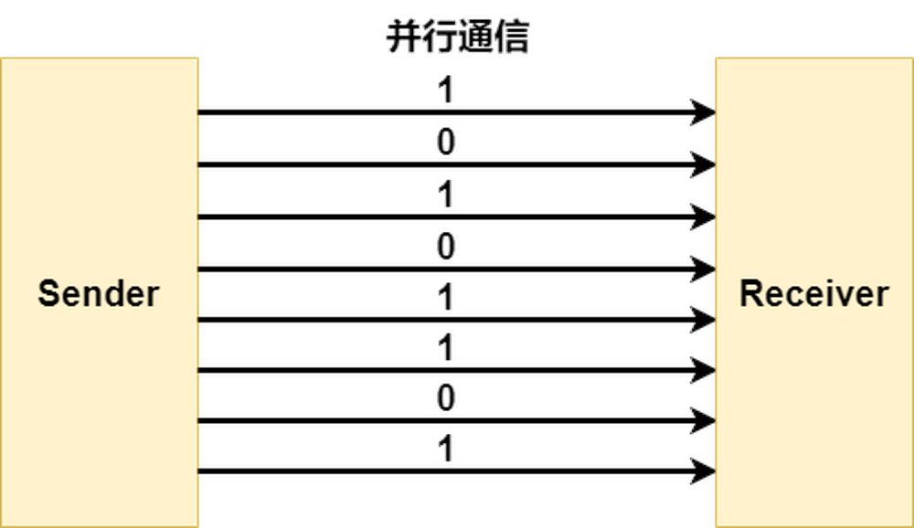

```diagram
					t0
(device0_port0) -> bit0 -> (device1_port0)
(device0_port1) -> bit1 -> (device1_port1)
(device0_port2) -> bit2 -> (device1_port2)
(device0_port3) -> bit3 -> (device1_port3)
(device0_port4) -> bit4 -> (device1_port4)
(device0_port5) -> bit5 -> (device1_port5)
(device0_port6) -> bit6 -> (device1_port6)
(device0_port7) -> bit7 -> (device1_port7)
```
